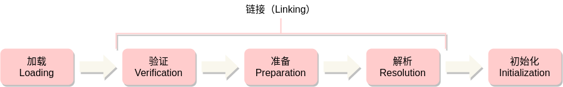
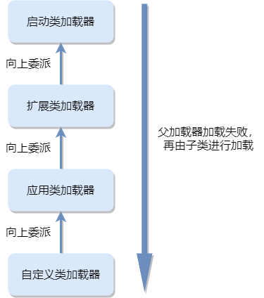

# 类加载

> class文件中的各项信息，需要被虚拟机加载后才能使用，本节内容主要介绍Java虚拟机的类加载过程。

将描述类或接口信息的各项信息从class文件（二进制字节流）中加载到内存，并对其进行校验、解析和初始化、最终变成可被虚拟机直接使用的数据，这个过程被称为虚拟机的类加载机制。

Java的类加载是在程序运行期间完成的，这为Java的提前编译造成了额外的困难，而且增加了一些额外的性能消耗，但是却为Java应用提供了极高的扩展性和灵活性。例如：Java应用程序可以从网络或其他地方加载class文件（二进制字节流）作为程序的一部分来运行。

## 类加载过程

[《Java虚拟机规范》][jvm_spec_8]中将类加载的过程分为三个阶段：

- 加载：查找特定名称的类或接口的二进制表示形式（class文件），并根据它创建类或接口的过程
- 链接：获取类或接口，并将其组合到Java虚拟机的运行时系统以便程序执行的过程
- 初始化：执行类或接口的初始化方法`<clinit>`的过程

链接又可以细分为验证、准备、解析三个阶段，如下图所示：



在类加载的过程中，加载 -> 验证 -> 准备 -> 初始化，这四个阶段的顺序是固定的，而解析阶段则不一定。在某些情况下，解析可以在初始化阶段之后再开始，这是为了支持Java语言的动态绑定特性。

> **说明：** 类加载过程中的各个阶段有可能是重合的，但整体顺序保持不变。例如，加载阶段与链接阶段的部分动作是重合的，加载未完成时，链接阶段可能已经开始，但加载阶段和链接阶段的开始时间还是保持着先后顺序的。

### 加载

加载是类加载过程中的第一个阶段，加载的动作是通过类加载器来完成的。当虚拟机需要创建一个类或接口的时候必须先进行加载，Java虚拟机会先确定类加载器是否已被记录为某个类或接口的初始类加载器，如果是，则该类或接口不需要再加载。

> **说明：** 类加载器L可以直接加载类或接口C，也可以将它委托给其他类加载器进行加载。如果L直接完成了C的加载，就将L称为C的定义类加载器；如果L将C委托给另外一个类加载器加载，则将L称为C的初始类加载器。

对于非数组类型，Java虚拟机可以通过内置的引导类加载器进行加载，也可以通过用户自定义的类加载器进行加载。自定义类加载器必须继承自`java.lang.ClassLoader`抽象类，用户可以重写其`findClass()`或`loadClass()`方法，根据自己的需要加载类或接口的二进制字节流。

对于数组类型，则是由虚拟机直接在内存中构造，并不需要通过类加载器进行加载（数组的元素类型还是需要通过类加载器来加载）。Java虚拟机通过组件类型（Component Type，指的是数组去掉一个维度之后的类型，并非数组的元素类型）和维度数来创建数组，创建过程遵循如下规则：

- 如果数组的组件类型（例如`Object[][]`的组件类型为`Object[]`）是引用类型，就采用递归的方式去加载该组件类型，虚拟机会把数组与创建该组建类型的类加载器进行关联记录；如果组件类型不是引用类型（例如`int[]`的组件类型为`int`），虚拟机会把数组与引导类加载器进行关联记录
- 如果数组的组件类型是引用类型，则数组的访问性由该组件类型决定；否则，数组的访问性为`public`

在加载阶段，Java虚拟机需要完成三件事：

1. 根据类或接口的全限定名称来获取该类的二进制字节流
1. 将这个类或接口的class文件（二进制字节流）中的静态存储结构（无符号数和表）转换为方法区中的运行时数据结构
1. 在内存中生存一个代表该类的`java.lang.Class`对象，作为方法区中该类的各种数据的访问入口

如果加载类或接口过程中出现错误，则必须在使用该类或接口的地方抛出一个`java.lang.LinkageError`的子类异常（如`java.lang.NoClassDefFoundError`）。如果在验证或解析阶段需要加载类或接口C，而C的初始类加载器抛出了一个`java.lang.ClassNotFoundException`实例，则Java虚拟机必须抛出`java.lang.NoClassDefFoundError`实例，其`cause`就是该`ClassNotFoundException`实例。

加载阶段完成之后，Java虚拟机就已经将类或接口的二进制表示中的数据存储到方法区中了，并且会在堆中实例化一个`java.lang.Class`对象，作为程序访问方法区中该类或接口数据的外部接口。

> **说明：** [《Java虚拟机规范》][jvm_spec_8]中没有规定方法区中具体的数据结构，完全由虚拟机实现自己定义。

### 验证

验证是链接的第一个阶段，其目的是为了确保class文件的完整性，以及其中的信息符合[《Java虚拟机规范》][jvm_spec_8]的约束规则，保证这些信息不会对虚拟机本身产生危害。

验证阶段，Java虚拟机会对class文件作非常详细的校验，具体的校验规则请阅读[4.10. Verification of class Files][jvm_spec_8_4_10]作深入了解，这里不逐一解释。整体来看，校验的内容大致可以分为如下四个部分：

1. 文件格式校验
1. 元数据校验
1. 字节码校验
1. 符号引用校验

#### 文件格式校验

文件格式校验主要是为了验证加载的二进制流是否符合class文件格式的规范，保证class文件的字节流能正确的解析并存储在方法区中。

文件格式校验是基于类或接口的字节流进行的，经过这部分校验之后，字节流被虚拟机实现转换为特定的结构存储在方法区中，而其他部分的校验则是基于字节流在方法区的存储结构进行的。

文件格式校验包括如下等内容：

- 校验class文件中的魔数（是否以`0xCAFEBABE`开头）
- 校验class文件版本号（是否超过对应的虚拟机版本）
- 校验常量池中各项数据结构的tag标志
- 校验 *CONSTANT_UTF8_info* 结构数据中是否存在不符合`UTF-8`编码的数据
- class文件各个部分及文件本身是否有被删除或附加的其他信息

#### 元数据校验

元数据校验主要是对类或接口的元数据信息进行语义校验，确保其符合[《Java语言规范》][jls]的要求。

元数据校验包括如下等内容：

- 该类是否有父类（除`java.lang.Object`之外，所有类都应该有父类）
- 是否继承了不允许被继承的类（被`final`修饰的类）
- 如果这个类不是抽象类，是否实现了其父类或接口中的所有抽象方法
- 类或接口中的字段、方法的定义是否正确，是否与父类矛盾

#### 字节码校验

字节码校验主要是对方法体（class文件中的 *Code* 属性）进行校验，通过数据流分析和控制流分析，确保程序语义正确，在运行时不会危害虚拟机的安全。

字节码校验包括如下等内容：

- 保证任意时刻操作数栈的数据类型与指令代码序列都能配合工作
- 保证跳转指令不会跳到方法体以外的字节码指令
- 保证方法体中的类型转换总是有效

由于数据流分析和控制流分析的高度复杂性，所以字节码校验是验证阶段中最为复杂的部分，为了节省字节码校验的耗时（整个类加载过程都是在程序运行期间进行的，因此耗时越久，程序执行性能就越差），JDK6之后的javac编译器和Java虚拟机进行了一项联合优化，把尽可能多的校验挪到javac编译器中进行。javac编译器在 *Code* 属性中添加了一项 *StackMapTable* 新属性，用于描述方法体中所有的基本块（Basic Block，按控制流拆分的代码块）开始时本地变量表和操作数栈应有的状态，这样Java虚拟机只需要检查 *StackMapTable* 属性中的记录是否合法即可，从而节省了大量的校验时间。

#### 符号引用校验

符号引用校验主要是将符号引用转化为直接引用，这个转换动作发生在解析阶段，其目的是确保解析动作能正常执行。符号引用验证可以看作是对类自身以外的各类信息进行校验（该类是否缺少或禁止访问其依赖的外部字段、方法等资源）。

符号引用校验包括如下等内容：

- 符号引用中通过全限定名能否找到对应的类
- 类中是否存在符合描述符的字段或方法

如果符号引用校验未通过，Java虚拟机将会抛出`java.lang.IncompatibleClassChangeError`的子类异常，如：`java.lang.IllegalAccessError`、`java.lang.NoSuchFieldError`、`java.lang.NoSuchMethodError`等。

> **说明：** 对于类加载机制而言，验证阶段非常重要，但并非必须。用户可以通过`-Xverify:none`参数来关闭大部分验证措施，缩短类加载的耗时。

### 准备

准备阶段的工作主要是为类中定义的静态字段（被`static`修饰的成员变量）分配内存并设置初始化值。从概念上讲，这些静态字段的内存应当在方法区中分配，但实际上“方法区”只是一个逻辑上的内存区域，在JDK7之前，HotSpot虚拟机使用永久代来实现方法区，而在JDK8及以后，这些变量则是随着`Class`对象一起存放在堆中。

准备阶段并不会为实例变量（非静态成员变量）分配内存和初始化，而是在对象实例化时跟随对象一起在堆中分配内存的。

准备阶段设置的初始值“通常情况下”是指数据类型的零值（基本类型的默认值），而非程序中赋值的初始值。

**示例：** 如下代码中的静态变量`i`在经过准备阶段后的初始值为0（`int`类型的默认值），而不是47。

```java
public static int i = 47;
```

这段代码的赋值操作在javac编译后变成 *putstatic* 指令，存放在类或接口构造器`<clinit>`方法中，在类的初始化阶段才会执行。

如果类的字段属性表中存在 *ConstantValue* 属性，则准备阶段会直接将其所指定的值赋给静态变量。如果上例修改为：

```java
public static final int i = 47;
```

javac编译器会为变量`i`生成一个 *ConstantValue* 属性，则准备阶段完成后`i`的值为47。

### 解析

解析是根据运行时常量池中的符号引用动态确定具体值的过程。

解析阶段发生的具体时间并不确定，当虚拟机执行到 *anewarray*, *checkcast*, *getfield*, *getstatic*, *instanceof*, *invokedynamic*, *invokeinterface*, *invokespecial*, *invokestatic*, *invokevirtual*, *ldc*, *ldc_w*, *multianewarray*, *new*, *putfield* 和 *putstatic* 这些会对运行时常量池进行符号引用的指令时，必须先解析符号引用。

从程序代码来看，对于同一个符号引用，可能需要进行多次解析，Java虚拟机实现可以对第一次解析后的结果进行缓存，从而避免重复解析。对于 *invokedynamic* 指令，这种缓存解析结果的方式则不适用，因为 *invokedynamic* 指令本来就是用来支持Java动态语言特性的，程序必须执行到这条指令时才能进行解析动作，而其他指令可以在加载完成之后就开始进行解析。

#### 类或接口解析

假设代码所处的类为D，把符号引用N解析为类或接口C的直接引用，解析过程如下：

1. 如果C不是数组，则使用D的定义类加载器创建C，创建C过程中抛出的任何异常都可以作为类或接口解析失败的结果抛出
1. 如果C是数组，且元素类型为引用类型，则通过递归方式对数组元素类型进行解析
1. 检查D对C的访问权限，如果D无法访问C，则抛出`IllegalAccessError`异常

#### 字段解析

假设字段所处的类为D，对字段进行解析时需要先对字段所属的类或接口C的符号引用进行解析，解析过程如下：

1. 在C中查找是否存在名称和描述符都相同的字段，如果找到，则查找成功，返回的该字段的直接引用
1. 否则，如果C实现了接口，按照继承关系从下往上递归查找各个接口和父接口
1. 否则，如果C不是`java.lang.Object`类，按照继承关系从下往上递归查找其父类
1. 如果查找失败，抛出`java.lang.NoSuchFieldError`异常
1. 如果查找成功，但是没有对字段的访问权限，则抛出`IllegalAccessError`异常

#### 方法解析

在Java虚拟机中，方法解析（实例方法）与接口方法解析是分开的，与字段解析一样，方法解析时也需要先对方法所在类C解析，解析过程如下：

1. 如果C是一个接口，抛出`IncompatibleClassChangeError`异常
1. 否则，在C中查找是否存在名称和描述符都相同的方法，如果找到，则查找成功，返回该方法的直接引用
1. 否则，在C的父类中递归查找，如果C是抽象类，抛出`java.lang.AbstractMethodError`异常
1. 否则，查找失败，抛出`java.lang.NoSuchMethodErro`异常
1. 如果查找成功，但是没有对方法的访问权限，则抛出`IllegalAccessError`异常

#### 接口方法解析

接口方法解析与方法解析类似，解析过程如下：

1. 如果C是一个类而不是接口，抛出`IncompatibleClassChangeError`异常
1. 否则，在C中查找是否存在名称和描述符都相同的方法，如果找到，则查找成功，返回该方法的直接引用
1. 否则，在C的父接口（包括`java.lang.Object`类）中递归查找
1. 否则，查找失败，抛出`java.lang.NoSuchMethodErro`异常
1. 如果查找成功，但是没有对方法的访问权限，则抛出`IllegalAccessError`异常

#### 方法类型和句柄解析

方法类型解析成功后的结果是一个指向`java.lang.invoke.MethodType`实例的引用，表示一个方法描述符。

方法句柄解析成功后的结果是一个指向`java.lang.invoke.MethodHandle`实例的引用，表示一个方法句柄。

#### 动态调用限定符解析

动态调用限定符（Call Site Specifier）是 *invokedynamic* 指令所对应的符号引用，其解析结果是一个元组，包括：

- 指向一个`java.lang.invoke.MethodHandle`实例的引用
- 指向一个`java.lang.invoke.MethodType`实例的引用
- 指向 `java.lang.Class`，`java.lang.invoke.MethodHandle`，`java.lang.invoke.MethodType`和`String`实例的引用

### 初始化

初始化时类加载的最后一个阶段，[《Java虚拟机规范》][jvm_spec_8]中对初始化的时机作了严格的规定，当且仅当遇到如下6种情况时才会发生初始化：

- 当虚拟机遇到 *new*，*getstatic*，*putstatic* 或 *invokestatic* 这四条指令时，必须立即进行初始化
- 如果`java.lang.invoke.MethodHandle`实例是 *REF_getStatic*、*REF_putStatic*、*REF_invokeStatic*、*REF_newInvokeSpecia* 这四种类型方法句柄的解析结果，则该句柄对应的类需要先进行初始化
- 使用 *java.lang.reflect* 包的方法对类型进行反射调用时，需要先进行初始化
- 对子类进行初始化时，如果其父类还没有初始化，则必须先对父类进行初始化
- 接口中声明了非抽象、非静态的方法（`default`方法，JDK8及以上版本中支持），则调用之前需要先初始化
- 虚拟机启动的主类（`main()`方法所在类）需要先初始化

初始化阶段主要是执行类或接口构造器`<clinit>()`方法，`<clinit>()`方法是由编译器在字节码生成阶段产生的，但并非所有类都会生成该方法，如果一个类中没有静态语句块，也没有对变量的赋值操作，那么编译器可以不为这个类生成`<clinit>()`方法。

接口也会生成`<clinit>()`方法，但是执行接口中的`<clinit>()`方法时并不需要先执行父接口的`<clinit>()`方法， 因为只有当父接口中定义的变量被使用时，父接口才会被初始化。接口的实现类在初始化时也不需要执行接口的`<clinit>()`方法。

虚拟机实现必须保证`<clinit>()`方法在多线程情况下可以被正确同步，如果多个线程同时初始化一个类，只能有一个线程执行`<clinit>()`方法，其他线程不会重复执行该方法。

## 类加载器

在加载阶段，“根据类或接口的全限定名称来获取该类的二进制字节流”这个动作是通过类加载器来实现的。

从虚拟机的角度来看，有两种不同的类加载器：

- 启动类加载器：由C++语言实现，是虚拟机本身的一部分

- 其他类加载器：由Java语言实现，独立存在于虚拟机外部，且必须继承`java.lang.ClassLoader`这个抽象类

每个类加载器都有一个独立的类名称空间，对于任意一个类，其在虚拟机中的唯一性由加载它的类加载器和它本身共同确定。如果一个类由两个不同的类加载器加载，则这加载出来的两个实例必不相等，这个“相等”的含义包括：代表了当前类的`Class`对象的`equals()`方法、`isAssignableFrom()`方法、`isInstance()`方法和`instanceof`关键字的返回结果。

**示例：** 如下代码中定义了一个简单的自定义类加载器，用它对同一个类`ClassLoaderTest`进行加载

```java
public class ClassLoaderTest {

    public static void main(String[] args) throws Exception {
        ClassLoaderTest test = new ClassLoaderTest();
        ClassLoader userClassLoader = new ClassLoader() {
            @Override
            public Class<?> loadClass(String name) throws ClassNotFoundException {
                try {
                    String filename = name.substring(name.lastIndexOf(".") + 1) + ".class";
                    InputStream inputStream = getClass().getResourceAsStream(filename);
                    if (inputStream == null) {
                        return super.loadClass(name);
                    }
                    byte[] bytes = new byte[inputStream.available()];
                    inputStream.read(bytes);
                    return defineClass(name, bytes, 0, bytes.length);
                } catch (IOException e) {
                    throw new ClassNotFoundException(name);
                }
            }
        };
        Object userTest = userClassLoader.loadClass("org.jvm.loading.ClassLoaderTest").newInstance();
        System.out.println(test.getClass().getClassLoader());
        System.out.println(userTest.getClass().getClassLoader());
        System.out.println(userTest.getClass().equals(test.getClass()));
        System.out.println(userTest.getClass().isAssignableFrom(test.getClass()));
        System.out.println(userTest.getClass().isInstance(test));
        System.out.println(userTest instanceof ClassLoaderTest);
    }
}
```

该代码示例的执行结果如下：

```text
sun.misc.Launcher$AppClassLoader@18b4aac2
org.jvm.loading.ClassLoaderTest$1@28d93b30
false
false
false
false
```

可以发现控制台中打印了4个`false`，这说明类在虚拟机中的唯一性是由加载它的类加载器和它本身共同确定的。

### 三层类加载器

从Java应用程序的角度来看，类加载器一般分为三种，也就是所谓的“三层类加载器”：

- 启动类加载器：又称引导类加载器，负责将 *\<JAVA_HOME\>\lib* 目录，或者被`-Xbootclasspath`参数所指定的路径中存放的，能够被虚拟机识别的合法的类库（如：*rt.jar*，*tools.jar*）加载到虚拟机内存中。启动类加载器无法被Java程序直接引用，用户在编写自定义类加载器时如果需要把加载请求委派给引导类加载器处理，可以直接返回`null`。
- 扩展类加载器：在`sun.misc.Launcher.ExtClassLoader`类中实现，负责加载 *\<JAVA_HOME\>\lib\ext* 目录，或者`java.ext.dirs`系统变量所指定的路径下的类库。
- 应用程序类加载器：在`sun.misc.Launcher.AppClassLoader`类中实现，这是应用程序默认的类加载器，负责加载用户路径上（ClassPath）所有的类库。

如下是`java.lang.Class`类中`getClassLoader()`方法的源码片段及部分注释，说明`null`可以代表引导类加载器。

```java
/**
 * Returns the class loader for the class.
 * Some implementations may use null to represent the bootstrap class loader. 
 */
public ClassLoader getClassLoader() {
    ClassLoader cl = getClassLoader0();
    if (cl == null)
        return null;
    SecurityManager sm = System.getSecurityManager();
    if (sm != null) {
        ClassLoader.checkClassLoaderPermission(cl, Reflection.getCallerClass());
    }
    return cl;
}
```

### 双亲委派模型

三层类加载器之间的层次关系被称为“双亲委派模型”，如下图所示：



这种层次结构是基于组合来实现的，每个类加载器（引导类加载器除外）都包含一个父加载器。

双亲委派模型的工作过程是：如果一个类加载器接收到类加载请求，它不会先自己去加载这个类，而是将这个类加载请求委托给父加载器去进行加载，这样逐层向上委派，最终委派给引导类加载器；如果父加载器无法完成加载请求（没找到对应的类），子加载器才会尝试自己去加载。

这种双亲委派模型的一个好处是：Java中的类会跟随它的类加载器一起具备一种层次关系（越基础的类由越顶层的类加载器进行加载），这样可以很好的保证类的唯一性。例如：无论使用哪个类加载器加载 *rt.jar* 中的`java.lang.Object`类，加载请求最终都会被委托给引导类加载器，这就可以很好的保证`java.lang.Object`类的唯一性。如果用户自己也编写了一个`java.lang.Object`类，那么它可以编译，但是永远无法加载运行。

从源码角度来看，双亲委派模型的具体加载过程实现在`java.lang.ClassLoader`类的`loadClass()`方法中：

```java
protected Class<?> loadClass(String name, boolean resolve)
    throws ClassNotFoundException
{
    synchronized (getClassLoadingLock(name)) {
        // First, check if the class has already been loaded
        Class<?> c = findLoadedClass(name);
        if (c == null) {
            long t0 = System.nanoTime();
            try {
                if (parent != null) {
                    c = parent.loadClass(name, false);
                } else {
                    c = findBootstrapClassOrNull(name);
                }
            } catch (ClassNotFoundException e) {
                // ClassNotFoundException thrown if class not found
                // from the non-null parent class loader
            }

            if (c == null) {
                // If still not found, then invoke findClass in order
                // to find the class.
                long t1 = System.nanoTime();
                c = findClass(name);

                // this is the defining class loader; record the stats
                sun.misc.PerfCounter.getParentDelegationTime().addTime(t1 - t0);
                sun.misc.PerfCounter.getFindClassTime().addElapsedTimeFrom(t1);
                sun.misc.PerfCounter.getFindClasses().increment();
            }
        }
        if (resolve) {
            resolveClass(c);
        }
        return c;
    }
}
```

这段代码的逻辑很清晰：

1. 先检查给定名称所表示的类或接口是否已经被加载过，如果已加载过，就进行解析
1. 如果没有加载过，且父加载器不为`null`，则调用父加载器的`loadClass()`方法进行加载
1. 如果父加载器为`null`，则使用引导类加载器进行加载
1. 如果父类加载器加载失败，抛出`ClassNotFoundException`异常，则调用自己的`findClass()`方法尝试进行加载

实际上，虽然类加载器的概念和`java.lang.ClassLoader`类在Java的第一个版本就已经存在，但是双亲委派模型是在JDK1.2之后才引入的。双亲委派模型并非适用于所有场景，例如：JNDI服务。按道理来说，这种基础服务应该由引导类加载器进行加载，但是它却需要调用由第三方实现并部署在应用程序类路径（ClassPath）下的服务提供者接口（Service Provider Interface，SPI），这其实违背了双亲委派模型。到了JDK9，由于引入了模块化，双亲委派模型也发生了一些改变。关于这部分内容，感兴趣的读者可以阅读[《深入理解Java虚拟机（第3版）》][deep_in_jvm_3]第7.5节内容作深入了解。

[jvm_spec_8]: https://docs.oracle.com/javase/specs/jvms/se8/html/index.html
[jvm_spec_8_4_10]: https://docs.oracle.com/javase/specs/jvms/se8/html/jvms-4.html#jvms-4.10
[jls]: https://docs.oracle.com/javase/specs/jls/se8/html/index.html
[deep_in_jvm_3]: https://book.douban.com/subject/34907497/
