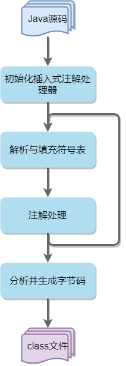
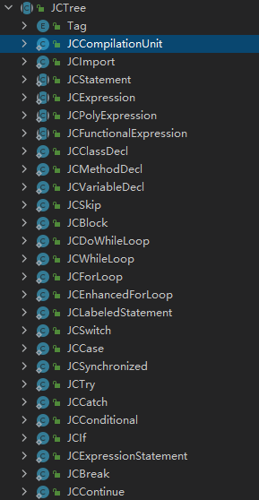
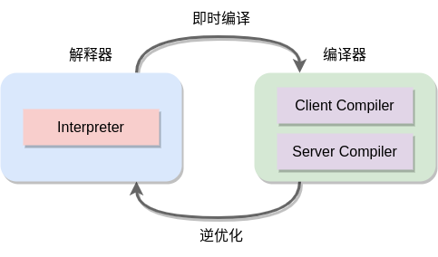
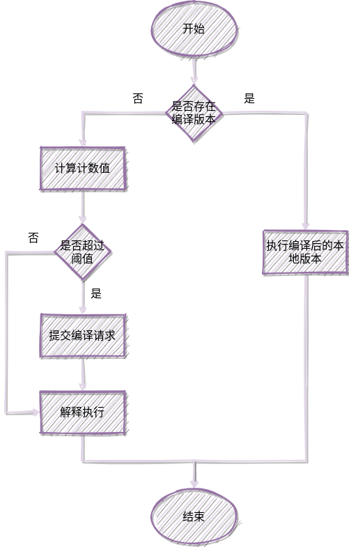

# Java编译

> 本节内容主要介绍Java编译的相关内容。[《Java虚拟机规范》][jvm_spec_8]第三章中给出了很多示例用以说明如何将Java程序编译成虚拟机指令，但本节并不对这部分内容作介绍，感兴趣的读者请阅读 [Chapter 3. Compiling for the Java Virtual Machine][jvm_spec_8_c3]作详细了解。

计算机并不能直接执行源代码，程序的执行需要一个将代码转换成能被计算机识别和执行的机器码的过程。传统来讲，有两种方法可以将高级编程语言的源代码转换成特定平台的机器码：

- **编译执行：** 通过编译器，将高级语言代码编译成特定平台的机器码，特点是需要编译，启动比较耗时，但是执行效率快，常见的编译型语言有：C，C++，Go等

- **解释执行：** 通过解释器，将代码逐条读取和翻译成特定平台的机器码，不做保存，特点是程序启动快，但是执行效率慢，常见的解释型语言有：Python、JavaScript、PHP、Shell等

但是Java比较特殊，它既不是纯粹的编译型语言，也不是纯粹的解释型语言。Java源码需要先编译成一种独立于平台的中间表示形式（class文件），然后再通过Java虚拟机将字节码指令转换为特定平台的机器码来执行。

> **说明：** Java开创了这种基于中间语言表示（Intermediate Language, IL）的跨平台的方式，C#与Java类似，但似乎止步于Windows平台。

因此，在Java中，如果没有明确的上下文，“编译”这个词其实是一个语义模糊的表述，它可以表示不同的过程：

- **前端编译：** 将Java源码编译成class文件的过程

- **后端编译：** 将字节码转换成特定平台的机器码的过程

## 前端编译

我们通常所说的“编译”，在大多数情况下是指前端编译。常见的前端编译器有：JDK的javac编译器、Eclipse JDT中的增量式编译器（ECJ），本小节主要结合源码介绍一下javac编译器的编译过程。

不同于HotSpot虚拟机，javac编译器是由纯Java代码编写的。JDK8中的javac编译器源码存放在 *langtools* 中，具体路径是 */langtools/src/share/classes/com/sun/tools/javac*，感兴趣的读者可以从[OpenJDK官网][openjdk]的 *JDK 8 Updates Master* 分支下载[langtools源码][langtools]，然后导入到IDE中进行研究，本节内容的源码说明也是基于该分支版本。

### javac编译步骤

javac编译器的编译步骤可以大致分为以下四个过程：

1. 准备：初始化插入式注解处理器
1. 解析与填充符号表：
   -  词法及语法分析：将源代码字符流处理成标记集合，构造出抽象语法树
   -  填充符号表：产生符号地址与符号信息
1. 处理注解：插入式注解处理器执行注解处理
1. 分析并生成字节码：
   - 标注检查：对语法静态信息进行检查
   - 数据流及控制流分析：对程序运行时过程进行检查
   - 解语法糖：将Java语法糖简化的代码还原为原有的形式
   - 生成字节码：将各个步骤中生成的信息转换为字节码

上述编译步骤中，执行插入式注解时会产生新的符号，然后再对新产生的符号进行解析与填充，这个过程可重复循环多次，整体的编译处理过程如下图所示：



从源码的角度来看，javac编译动作的入口是`com.sun.tools.javac.main.JavaCompiler`类中的`compile()`方法，源码片段如下所示：

```java
// ****************************** 源码片段 ****************************** //
// 准备：初始化注解处理器
initProcessAnnotations(processors);

// These method calls must be chained to avoid memory leaks
delegateCompiler =
    // 1.parseFiles()方法：词法、语法分析
    // 2.enterTrees()方法：填充符号表
    // 3.processAnnotations()方法：执行注解处理
    processAnnotations(enterTrees(stopIfError(CompileState.PARSE, parseFiles(sourceFileObjects))), classnames);
// 分析并生成字节码
delegateCompiler.compile2();
```

分析并生成字节码的详细步骤被封装在`compile2()`方法中，源码片段如下所示：

```java
// ****************************** 源码片段 ****************************** //
case BY_TODO:
    while (!todo.isEmpty())
        // 1.attribute()方法：标注
        // 2.flow()方法：数据流分析
        // 3.desugar()方法：解语法糖
        // 4.generate()方法：生成字节码
        generate(desugar(flow(attribute(todo.remove()))));
    break;
```

#### 解析并填充符号表

Java源码文件的解析过程由`parseFiles()`方法完成，该方法中封装了词法分析和语法分析过程，将源码文件列表处理成抽象语法树。

##### 词法分析和语法分析

词法分析是将源码字符序列处理成标记（Token）序列集合的过程。Token是编译的最小单元，它可以表示关键字、运算符、字面量、变量名等语法层面的最小构成元素。例如：`int a = 1;`这句代码可以解析出`int`、`a`、`=`、`1`、`;`这5个Token。

语法分析是根据Token序列集合构造成抽象语法树（Abstract Syntax Tree，AST）的过程。抽象语法树是一个描述程序代码语法结构的树形结构，抽象语法树中的每个节点都代表程序代码中的一个语法结构（Syntax Construct），例如：包、类型、修饰符、运算符、接口、返回值、注释等。

从源码角度来看，javac编译器的词法分析和语法分析过程是通过`com.sun.tools.javac.parser.JavacParser`类来实现的，它实现了`com.sun.tools.javac.parser.Parser`接口，内部包含一个词法分析器`com.sun.tools.javac.parser.Scanner`，用于将源码字符序列转换成Token序列，然后调用`parseCompilationUnit()`方法将Token序列构造成`com.sun.tools.javac.tree.JCTree.JCCompilationUnit`对象。`JCCompilationUnit`表示一个编译单元，继承了`com.sun.tools.javac.tree.JCTree`类，`JCTree`是抽象语法树节点的顶层抽象类，内部定义了很多特定的树节点子类：



词法分析和语法分析的入口方法是`parse(JavaFileObject filename, CharSequence content)`方法，源码片段如下所示：

```java
// ****************************** 源码片段 ****************************** //
// 创建JavacParser对象，内部包含了词法分析器Scanner类，content是Java源码的字符序列
Parser parser = parserFactory.newParser(content, keepComments(), genEndPos, lineDebugInfo);
// 构造抽象语法树
tree = parser.parseCompilationUnit();
```

##### 填充符号表

符号表是由一组符号地址和符号信息组成的数据结构，符号表中的信息在编译的不同阶段都会被用到，例如：语义检查、产生中间代码、按符号名进行地址分配。填充符号表是遍历解析步骤中产生的抽象语法树列表，生成类符号信息，并填充到符号表的过程。

填充符号表分为两个阶段：

1. 第一阶段，遍历抽象语法树，将所有遇到的定义都填充到符号表里，并填充其对应的范围。对于其他类成员的类，自上而下地递归抽象语法树，给类符号添加一个`MemberEnter`对象作为完成者，并添加到`uncompleted`队列中

1. 第二阶段，通过`MemberEnter.complete()`方法来给未完成的类符号进行填充，这个填充动作可能是按需发生的，但是所有未通过这种方式完成填充的类都会通过`uncompleted`列表来处理。填充完成需要两个步骤：

   （1）确定类的参数、父类型、接口，然后将类放入`halfcompleted`队列

   （2）将类中的所有符号填充到其对应的范围，只有步骤（1）完成才能进行步骤（2）

从源码角度来看，在`enterTrees()`方法中，javac编译器通过`com.sun.tools.javac.comp.Enter`类来完成第一阶段的符号填充，最终产生一个待完成列表，其中包含了每一个编译单元的抽象语法树的顶级节点，以及`package-info.java`（如果存在的话）的顶级节点。

`Enter`类通过`classEnter()`方法进行符号填充：

```java
// ****************************** 源码片段 ****************************** //
/** Visitor method: enter classes of a list of trees, returning a list of types.
 */
<T extends JCTree> List<Type> classEnter(List<T> trees, Env<AttrContext> env) {
    ListBuffer<Type> ts = new ListBuffer<Type>();
    // 遍历抽象语法树列表，逐个进行填充
    for (List<T> l = trees; l.nonEmpty(); l = l.tail) {
        Type t = classEnter(l.head, env);
        if (t != null)
            ts.append(t);
    }
    return ts.toList();
}

/** Visitor method: enter all classes in given tree, catching any
 *  completion failure exceptions. Return the tree's type.
 *
 *  @param tree    The tree to be visited.
 *  @param env     The environment visitor argument.
 */
Type classEnter(JCTree tree, Env<AttrContext> env) {
    Env<AttrContext> prevEnv = this.env;
    try {
        this.env = env;
        // 这里使用了Visitor模式，实际调用的是JCTree.Visitor抽象类的visitXXX()方法进行填充
        tree.accept(this);
        return result;
    }  catch (CompletionFailure ex) {
        return chk.completionError(tree.pos(), ex);
    } finally {
        this.env = prevEnv;
    }
}
```

`Enter`类继承了`JCTree.Visitor`抽象类，并实现了`visitTopLevel(JCCompilationUnit tree)`和`visitClassDef(JCClassDecl tree)`方法。`visitClassDef(JCClassDecl tree)`方法中的源码片段：

```java
// ****************************** 源码片段 ****************************** //
// Enter class into `compiled' table and enclosing scope.
if (chk.compiled.get(c.flatname) != null) {
    duplicateClass(tree.pos(), c);
    result = types.createErrorType(tree.name, (TypeSymbol)owner, Type.noType);
    // 填入自身类的符号
    tree.sym = (ClassSymbol)result.tsym;
    return;
}
chk.compiled.put(c.flatname, c);
// 类符号填入对应的范围
enclScope.enter(c);

// ****************************** 源码片段 ****************************** //
// 添加一个MemberEnter对象，关联类成员的范围
c.completer = memberEnter;
c.flags_field = chk.checkFlags(tree.pos(), tree.mods.flags, c, tree);
c.sourcefile = env.toplevel.sourcefile;
c.members_field = new Scope(c);

// ****************************** 源码片段 ****************************** //
// Add non-local class to uncompleted, to make sure it will be
// completed later.
// 将非本地类添加到未完成队列，由MemberEnter来完成
if (!c.isLocal() && uncompleted != null) uncompleted.append(c);
```

`MemberEnter`类同样继承了`JCTree.Visitor`抽象类，通过`complete(Symbol sym)`方法完成第二阶段的符号填充，具体源码片段如下所示：

```java
// ****************************** 源码片段 ****************************** //
// Enter all member fields and methods of a set of half completed
// classes in a second phase.
if (wasFirst) {
    try {
        while (halfcompleted.nonEmpty()) {
            Env<AttrContext> toFinish = halfcompleted.next();
            // 完成填充
            finish(toFinish);
            if (allowTypeAnnos) {
                typeAnnotations.organizeTypeAnnotationsSignatures(toFinish, (JCClassDecl)toFinish.tree);
                typeAnnotations.validateTypeAnnotationsSignatures(toFinish, (JCClassDecl)toFinish.tree);
            }
        }
    } finally {
        isFirst = true;
    }
}

// ****************************** 源码片段 ****************************** //
/** Enter member fields and methods of a class
 *  @param env        the environment current for the class block.
 */
private void finish(Env<AttrContext> env) {
    JavaFileObject prev = log.useSource(env.toplevel.sourcefile);
    try {
        JCClassDecl tree = (JCClassDecl)env.tree;
        finishClass(tree, env);
    } finally {
        log.useSource(prev);
    }
}

/** Enter members for a class.
 */
void finishClass(JCClassDecl tree, Env<AttrContext> env) {
    if ((tree.mods.flags & Flags.ENUM) != 0 &&
        (types.supertype(tree.sym.type).tsym.flags() & Flags.ENUM) == 0) {
        addEnumMembers(tree, env);
    }
    // 通过memberEnter()方法来完成成员填充
    memberEnter(tree.defs, env);
}

/** Enter members from a list of trees.
 */
void memberEnter(List<? extends JCTree> trees, Env<AttrContext> env) {
    // 遍历抽象语法树，逐个进行填充
    for (List<? extends JCTree> l = trees; l.nonEmpty(); l = l.tail)
        memberEnter(l.head, env);
}

/** Enter field and method definitions and process import
 *  clauses, catching any completion failure exceptions.
 */
protected void memberEnter(JCTree tree, Env<AttrContext> env) {
    Env<AttrContext> prevEnv = this.env;
    try {
        this.env = env;
        // 这里跟Enter类一样，也是Visitor模式，实际调用的是vistiXXX()方法
        tree.accept(this);
    }  catch (CompletionFailure ex) {
        chk.completionError(tree.pos(), ex);
    } finally {
        this.env = prevEnv;
    }
}
```

#### 注解处理

Java在JDK5中引入了注解，注解在设计上原本只在程序运行期间发挥作用，但在JDK6中又添加了一组“插入式注解处理器”的API，可以在前端编译期间对特定代码进行注解处理，从而影响前端编译的过程。插入式注解处理器可以读取、添加和修改抽象语法树中的任意元素。如果插入式注解处理器在处理注解时对语法树进行过修改，编译器将回到解析及填充符号表的过程重新处理，直到所有插入式注解处理器都不再对语法树进行修改为止。

> **说明：** Lombok工具就是利用插入式注解处理器，在前端编译过程中，对特定的注解进行处理，从而生成`getter()/setter()`、`equals()`、`hashCode()`、`toString()`等方法

在javac源码中，通过`initProcessAnnotations()`方法对插入式注解处理器进行初始化，如果显式设置了注解处理器路径，则会从`ANNOTATION_PROCESSOR_PATH`路径下扫描并加载注解处理器，否则从`CLASS_PATH`路径下加载。如果使用`javac -processor`命令显示的指定了注解处理器，则会从特定路径查找具体的处理器类，否则利用SPI机制进行加载。注解处理器必须是`javax.annotation.processing.Processor`的实现类。

```java
// ****************************** 源码片段 ****************************** //
// If processorpath is not explicitly set, use the classpath.
processorClassLoader = fileManager.hasLocation(ANNOTATION_PROCESSOR_PATH)
    ? fileManager.getClassLoader(ANNOTATION_PROCESSOR_PATH)
    : fileManager.getClassLoader(CLASS_PATH);

// ****************************** 源码片段 ****************************** //
/*
 * If the "-processor" option is used, search the appropriate
 * path for the named class.  Otherwise, use a service
 * provider mechanism to create the processor iterator.
 */
if (processorNames != null) {
    processorIterator = new NameProcessIterator(processorNames, processorClassLoader, log);
} else {
    processorIterator = new ServiceIterator(processorClassLoader, log);
}
```

而对注解的处理则是在`processAnnotations()`方法中进行的，它会判断是否有新的注解处理器需要执行，如果有的话，则通过`com.sun.tools.javac.processing.JavacProcessingEnvironment`类的`doProcessing()`方法来生成一个新的`JavaCompiler`对象，对后续步骤进行处理。

```java
// ****************************** 源码片段 ****************************** //
try {
    // 处理注解
    JavaCompiler c = procEnvImpl.doProcessing(context, roots, classSymbols, pckSymbols,
                                              deferredDiagnosticHandler);
    if (c != this)
        annotationProcessingOccurred = c.annotationProcessingOccurred = true;
    // doProcessing will have handled deferred diagnostics
    return c;
} finally {
    procEnvImpl.close();
}
```

`doProcessing()`方法中会循环对注解进行处理，生成新的抽象语法树节点，然后重新填充符号表，该方法中的源码片段如下所示：

```java
// ****************************** 源码片段 ****************************** //
Round round = new Round(context, roots, classSymbols, deferredDiagnosticHandler);

boolean errorStatus;
boolean moreToDo;
do {
    // Run processors for round n
    round.run(false, false);

    // Processors for round n have run to completion.
    // Check for errors and whether there is more work to do.
    errorStatus = round.unrecoverableError();
    moreToDo = moreToDo();

    round.showDiagnostics(errorStatus || showResolveErrors);

    // Set up next round.
    // Copy mutable collections returned from filer.
    round = round.next(
        new LinkedHashSet<JavaFileObject>(filer.getGeneratedSourceFileObjects()),
        new LinkedHashMap<String,JavaFileObject>(filer.getGeneratedClasses()));

    // Check for errors during setup.
    if (round.unrecoverableError())
        errorStatus = true;
// 循环处理注解
} while (moreToDo && !errorStatus);

// run last round
round.run(true, errorStatus);
round.showDiagnostics(true);

// ****************************** 源码片段 ****************************** //
Set<JavaFileObject> newSourceFiles =
    new LinkedHashSet<JavaFileObject>(filer.getGeneratedSourceFileObjects());
roots = cleanTrees(round.roots);

JavaCompiler compiler = round.finalCompiler();

if (newSourceFiles.size() > 0)
    // 如果有新生成的文件，重新构造抽象语法树
    roots = roots.appendList(compiler.parseFiles(newSourceFiles));

// ****************************** 源码片段 ****************************** //
// 重新填充符号
compiler.enterTreesIfNeeded(roots);
```

#### 语义分析并生成字节码

语义分析是在语法分析之后对代码语义进行相关检查，确保代码语义正确，包括：类型检查，控制流检查，数据流检查等。

**示例：** 如下三个变量定义语句及赋值运算：

```java
int a = 1;
boolean b = false;
char c = 'c';

int d = a + c;  // 语义正确
int e = b + c;  // 语义错误
char f = a + c; // 语义错误
```

这段代码能构成正确的抽象语法树，但是只有第一个赋值运算是语义正确的，能通过检查和编译，另外两个复制运算则是语义错误的，在IDE工具中往往会出现红线标注的错误提示，这就是语义分析的检查结果。

javac编译器中的语义分析过程分为标注检查和数据及控制流分析两个步骤。

##### 标注检查

标注检查步骤需要检查的内容包括：变量使用前是否已声明，调用实例方法前是否初始化对象，数据类型是否匹配等等。在标注检查过程中还会对代码进行一个“常量折叠”的优化操作。

**示例：** 如下代码中的赋值操作在javac的编译过程中会计算出`1 + 2`的值，并直接将常量`3`赋值给变量`a`，这种操作被称为常量折叠

```java
int a = 1 + 2;
```

在javac源码中，标注检查是通过`attribute()`方法来完成的，该方法内部通过`com.sun.tools.javac.comp.Attr`和`com.sun.tools.javac.comp.Check`这两个类来进行标注和检查，`Attr`也继承了`JCTree.Visitor`抽象类，实际的标注检查动作也是通过`visitXXX()`方法来实现的。

```java
// ****************************** 源码片段 ****************************** //
/** The attributor.
 */
protected Attr attr;

/** The attributor.
 */
protected Check chk;

// ****************************** 源码片段 ****************************** //
// 调用Attr类的标注方法
attr.attrib(env);
if (errorCount() > 0 && !shouldStop(CompileState.ATTR)) {
    //if in fail-over mode, ensure that AST expression nodes
    //are correctly initialized (e.g. they have a type/symbol)
    attr.postAttr(env.tree);
}
compileStates.put(env, CompileState.ATTR);

// ****************************** 源码片段 ****************************** //
// 对赋值操作进行标注检查，Attr类中还有很多visitXXX()方法，这里不详细列举
public void visitAssign(JCAssign tree) {
    Type owntype = attribTree(tree.lhs, env.dup(tree), varInfo);
    Type capturedType = capture(owntype);
    attribExpr(tree.rhs, env, owntype);
    result = check(tree, capturedType, VAL, resultInfo);
}
```

##### 数据及控制流分析

数据流分析和控制流分析是对程序上下文更进一步的检查验证，它的检查内容包括：局部变量在使用前是否已赋值，方法的每条路径是否都有返回值，受检查异常是否被正确处理等等。

javac编译期间的数据及控制流分析与类加载期间的数据及控制流分析的目的基本上是相同的，但是校验范围有所不同，有些检查只在编译期间进行。

**示例：** `foo()`方法中的变量`a`声明时使用了`final`关键字修饰，而`goo()`方法中的变量`a`并没有用`final`修饰

```java
public void foo() {
    final int a = 0;
}

public void goo() {
    int a = 0;
}
```

但是这两个方法在编译后并没有区别，所有指令都一样，这说明将局部变量声明为`final`在运行时对程序没有任何影响，被`final`修饰的局部变量的不可变性是javac编译期间保证的

```text
public void foo();
  descriptor: ()V
  flags: (0x0001) ACC_PUBLIC
  Code:
    stack=1, locals=2, args_size=1
       0: iconst_0
       1: istore_1
       2: return
    LineNumberTable:
      line 7: 0
      line 8: 2
    LocalVariableTable:
      Start  Length  Slot  Name   Signature
          0       3     0  this   LTest;
          2       1     1     a   I

public void goo();
  descriptor: ()V
  flags: (0x0001) ACC_PUBLIC
  Code:
    stack=1, locals=2, args_size=1
       0: iconst_0
       1: istore_1
       2: return
    LineNumberTable:
      line 11: 0
      line 12: 2
    LocalVariableTable:
      Start  Length  Slot  Name   Signature
          0       3     0  this   LTest;
          2       1     1     a   I
```

在javac源码中，数据及控制流分析通过`flow()`方法完成，该方法内部则是通过`com.sun.tools.javac.comp.Flow`类来实现，部分源码片段如下所示：

```java
// ****************************** 源码片段 ****************************** //
/** The flow analyzer.
 */
protected Flow flow;

// ****************************** 源码片段 ****************************** //
make.at(Position.FIRSTPOS);
TreeMaker localMake = make.forToplevel(env.toplevel);
// 数据及控制流分析
flow.analyzeTree(env, localMake);
compileStates.put(env, CompileState.FLOW);

// ****************************** 源码片段 ****************************** //
public void analyzeTree(Env<AttrContext> env, TreeMaker make) {
    // 数据流分析的第一步，检查语句是否可达
    new AliveAnalyzer().analyzeTree(env, make);
    // 赋值检查
    new AssignAnalyzer().analyzeTree(env);
    // 数据流分析的第二步，分析受检查异常是否被正确处理
    new FlowAnalyzer().analyzeTree(env, make);
    // 数据流分析最后一步，检查lambda表达式内部的变量是否为final
    new CaptureAnalyzer().analyzeTree(env, make);
}
```

##### 解语法糖

语法糖是一个编程术语，它表示计算机编程语言中一种便捷的语法形式，对程序的执行结果没有实际影响，但是可以有效地减少代码量，增加程序可读性，减少程序出错的机会。很多现代的高级编程语言都提供了语法糖，相对而言，Java算是语法糖比较少的一种语言。

Java中支持的语法糖有：泛型、`foreach`循环、变长参数、自动装箱和拆箱等等。但是Java虚拟机运行时并不直接支持这些语法糖的简化语法，因此，javac在编译时会将代码还原到基础的语法结构，这个过程被称为解语法糖。关于Java中语法糖的详细说明，感兴趣的读者可以阅读周志明老师的[《深入理解Java虚拟机（第3版）》][deep_in_jvm_3]第10.3节的相关内容。

在javac源码中，解语法糖是通过`desugar()`方法完成的，该方法内部通过`com.sun.tools.javac.comp.TransTypes`类来做泛型类型擦除，通过`com.sun.tools.javac.comp.Lower`类来解语法糖，部分代码片段如下所示：

```java
// ****************************** 源码片段 ****************************** //
/** The type eraser.
 */
protected TransTypes transTypes;

/** The syntactic sugar desweetener.
 */
protected Lower lower;

// ****************************** 源码片段 ****************************** //
for (Env<AttrContext> dep: scanner.dependencies) {
    if (!compileStates.isDone(dep, CompileState.FLOW))
        // 优先循环对父类解语法糖
        desugaredEnvs.put(dep, desugar(flow(attribute(dep))));
}

// ****************************** 源码片段 ****************************** //
if (env.tree instanceof JCCompilationUnit) {
    if (!(stubOutput || sourceOutput || printFlat)) {
        if (shouldStop(CompileState.LOWER))
            return;
        List<JCTree> pdef = lower.translateTopLevelClass(env, env.tree, localMake);
        if (pdef.head != null) {
            Assert.check(pdef.tail.isEmpty());
            results.add(new Pair<Env<AttrContext>, JCClassDecl>(env, (JCClassDecl)pdef.head));
        }
    }
    return;
}

// ****************************** 源码片段 ****************************** //
// 类型擦除
env.tree = transTypes.translateTopLevelClass(env.tree, localMake);
compileStates.put(env, CompileState.TRANSTYPES);

// ****************************** 源码片段 ****************************** //
if (source.allowLambda() && scanner.hasLambdas) {
    if (shouldStop(CompileState.UNLAMBDA))
        return;
    // lambda表达式处理
    env.tree = LambdaToMethod.instance(context).translateTopLevelClass(env, env.tree, localMake);
    compileStates.put(env, CompileState.UNLAMBDA);
}
```

##### 生成字节码

生成字节码是javac编译的最后一个步骤，这个步骤中会将之前的步骤中产生的信息（抽象语法树、符号表）转化为字节码指令，并输出为class文件。

在生成字节码步骤中，javac编译器还会进行代码添加和转换的工作，例如：实例构造器方法`<init>()`方法和类构造器方法`<clinit>()`就是在这个步骤中添加到抽象语法树中的；字符串的拼接操作会被替换为`StringBuffer`或`StringBuilder`的`append()`操作。

在javac源码中，生成字节码由`generate()`方法来完成，内部是由`com.sun.tools.javac.jvm.Gen`类来实现的，部分源码片段如下所示：

```java
// ****************************** 源码片段 ****************************** //
/** The module for code generation.
 */
protected Gen gen;

// ****************************** 源码片段 ****************************** //
file = genCode(env, cdef);

// ****************************** 源码片段 ****************************** //
if (gen.genClass(env, cdef) && (errorCount() == 0))
    return writer.writeClass(cdef.sym);
```

至此，javac编译器的编译步骤就简单的介绍结束了，感兴趣的读者可以自行阅读源码，从而更深入地了解具体实现细节，囿于篇幅，这里就不再赘述了。

## 后端编译

如果把Java源文件转换为class文件的步骤看作Java编译过程中的前端部分，那么把字节码转换为特定平台的本地机器码的步骤可以称为编译过程的后端。

在Java虚拟机的后端编译领域中，通常有两种编译方式：

- **即时编译（JIT）：** 在运行时，将热点代码编译成特定平台的机器码，并保存在内存中，提高执行效率，当然也更耗内存。即时编译属于动态编译，它可以获得程序运行时的数据，从而进行动态的优化，但是会占用程序执行时间。
- **提前编译（AOT）：** 在运行前，直接把程序编译成特定平台的机器码，省去了即时编译在运行时的内存开销和耗时。提前编译属于静态编译，无法进行动态优化。

相对应的，分别有两类后端编译器：即时编译器（Just-In-Time Compiler）和提前编译器（Ahead-Of-Time Compiler）。在本小节内容中，将分别对即时编译器和提前编译器作简单介绍。

> **说明：** [《Java虚拟机规范》][jvm_spec_8]中并没有对后端编译器的实现做任何限制，因此后端编译器完全由具体的虚拟机自己实现。

### 即时编译器

在目前主流的Java虚拟机实现中，通常是解释器和编译器并存的。程序启动时，使用解释器立即执行，省去编译的时间，随着程序的执行，当虚拟机发现某个方法或代码块的运行特别频繁，就会把这些代码认定为“热点代码”，此时编译器逐渐发挥作用，把这些热点代码编译成特定平台的机器码，并存储在内存中，从而提高程序的执行效率。当程序运行环境中的内存资源限制较大时，又可以切换为解释器来执行，以减少内存消耗。解释器还可以充当编译器的“逃生门”，编译器编译时通常会采用一些优化手段来提高代码执行效率，当编译器因为采用了激进的优化手段而导致问题时，可以回退到解释执行的状态继续执行。

HotSpot虚拟机中采用的就是解释器和即时编译器并存的架构，如下图所示：



它有两个即时编译器，分别被称为：“客户端编译器（Client Compiler）”和“服务端编译器（Serve Compiler）”，又或者简称为：C1编译器和C2编译器。考虑到编译速度，C1编译器中并没有采用激进的编译优化手段，而C2编译器为了提高代码的执行速度，加入了很多激进的优化技术，同时也更加耗费编译时间。

> **说明：** 在JDK10中，HotSpot虚拟机又加入了一个处于实验状态的Graal编译器，其目的是为了取代C2编译器。与C1、C2编译器不同，Graal主要使用Java语言开发，既可以作为即时编译器使用，又可以作为提前编译器使用。

在分层编译的工作模式出现之前，HotSpot通常采用解释器与其中一个即时编译器搭配工作的“混合模式（mixed mode）”来运行，用户可以使用`java -version`命令来查看当前虚拟机的工作模式，也可以通过`-Xint`和`-Xcomp`参数来指定虚拟机运行于解释器模式或编译器模式。

**示例：** 如下是在OpenJDK 11环境下指定编译模式：

```bash
java -version
openjdk version "11" 2018-09-25
OpenJDK Runtime Environment 18.9 (build 11+28)
OpenJDK 64-Bit Server VM 18.9 (build 11+28, mixed mode)

java -Xint -version
openjdk version "11" 2018-09-25
OpenJDK Runtime Environment 18.9 (build 11+28)
OpenJDK 64-Bit Server VM 18.9 (build 11+28, interpreted mode)

java -Xcomp -version
openjdk version "11" 2018-09-25
OpenJDK Runtime Environment 18.9 (build 11+28)
OpenJDK 64-Bit Server VM 18.9 (build 11+28, compiled mode)
```

当HotSpot虚拟机处于混合模式时，解释器选择搭配哪一个即时编译器运行，则是由Java虚拟机根据自身版本和硬件性能自动选择的。用户也可以使用`-client`和`-server`参数来强制虚拟机搭配客户端编译器或者服务端编译器。

在JDK7中，Java虚拟机引入了分层编译功能，力求在程序启动性能和执行性能之间达到最佳平衡。分层编译将HotSpot虚拟机中的解释器和C1、C2编译器的执行划分为5个层次：

- Level 0：纯解释执行，并且不开启性能监控（Profiling）
- Level 1：使用C1即时编译，不开启性能监控
- Level 2：使用C1即时编译，开启方法及循环回边（字节码在循环体边界向后跳转）次数统计的性能监控
- Level 3：使用C1即时编译，除了Level 2中开启的性能监控，还开启分支跳转、方法调用、类型检测等性能监控
- Level 4：使用C2即时编译，开启全部性能监控

关于分层编译更详细的说明，感兴趣的读者可以阅读[深入浅出 Java 10 的实验性 JIT 编译器 Graal][graal_compiler]。

#### 即时编译的对象和条件

即时编译的对象是“热点代码”，主要包括两类：

- 被多次调用的方法
- 被多次执行的循环体 

对于这两类情况，编译器的编译对象都是整个方法，而不是单独的循环体。请读者注意，这里所说的“多次调用”和“多次执行”是一种不太准确的表述，实际上Java虚拟机是基于一项“热点探测”技术来判定哪些方法属于“热点代码”的。

目前主流的热点探测的判定方式有两种：

- 基于采样的热点探测：虚拟机会周期性的检查每个线程的调用栈，如果发现某个方法经常出现在栈顶，就判定这个方法是热点方法。这种判定方式有时会失真，比如某个线程的方法一直处于阻塞状态，那么它有可能也被误认为热点方法。
- 基于计数的热点探测：虚拟机会为每个方法创建一个计数器，统计方法的执行次数，如果计数超过一定阈值则认为它是热点方法。这种判定方法比较精确。

HotSpot虚拟机采用的是基于计数的热点探测方法，它为每个方法都创建了两种计数器：方法调用计数器、回边计数器。

方法调用计数器用于统计方法执行次数。默认情况下，编译阈值在客户端模式下为1500，在服务端模式下为10000。用户也可以通过`-XX:CompileThreshold`参数来更改这个阈值。请读者注意，方法调用计数器其实并非统计方法调用的绝对次数，而是一段时间限度内的方法调用次数。如果在一定的时间限度内，方法的调用次数并没有达到阈值，那么该方法的调用计数器就会减半，这个过程被称为热度衰减（Counter Decay），这个时间限度被称为半衰周期（Counter Half Life Time）。热度衰减操作是HotSpot虚拟机在进行垃圾回收时进行的。用户可以通过`-XX:UseCounterDecay`参数来关闭热度衰减，也可以使用`-XX:CounterHalfLifeTime`参数来设置半衰周期的时长，单位是秒。

回边计数器用于统计方法中循环体的执行次数。回边计数器触发编译的阈值并非一个固定值，而是通过公式计算得到的，这个公式在客户端模式下和服务端模式下并不相同：

- 在客户端模式下：$$回边计数器阈值 = \frac{方法调用计数器阈值 \times OSR比率}{100}$$

  其中，方法调用计数器阈值默认值为1500，OSR（栈上替换）比率默认值为933，因此客户端模式下回边计数器的默认阈值为13995。

- 服务端模式下：$$回边计数器阈值 = \frac{方法调用计数器阈值 \times (OSR比率- 解释器监控比率)}{100}$$

  其中，方法计数器阈值默认值为10000，OSR（栈上替换）比率默认值为140，解释器监控比率默认值为33，因此服务端模式下回边计数器的默认阈值为10700。

> **说明：** OSR（栈上替换）比率可以通过<code>-XX:OnStackReplacePercentage</code>参数修改，解释器监控比率可以通过<code>-XX:InterpreterProfilePercentage</code>参数修改。

#### 即时编译过程

在HotSpot虚拟机的即时编译过程中，当程序执行到方法入口或者遇到回边指令时，都会先判断当前是否存在已经编译过的本地机器码版本。如果存在，则直接执行编译后的本地机器码版本；如果不存在，则通过方法调用计数器或者回边计数器来计算本次执行是否超过阈值，如果不超过阈值，则继续解释执行；如果超过阈值，则向编译器提交编译请求，然后通过解释器执行代码。其大致流程如下：



上述流程中，虚拟机向编译器提交编译请求后并不会发生阻塞，而是在后台编译线程中执行执行编译，在编译完成之前，程序仍然以解释执行的方式运行。

编译器执行编译的过程也分为三个阶段：

1. 将字节码构造成一种与平台无关的高级中间表示形式（High-Level Intermediate Representation, HIR），并进行一些基础优化，比如：方法内连、常量传播等
1. 根据HIR生成一种平台相关的低级中间表示形式（Low-Level Intermediate
   Representation, LIR），并进行一些另外的优化，比如：空值检查消除、范围检查消除等
1. 使用线性扫描算法分配寄存器，并做窥孔（Peephole）优化，最后生成特定平台的机器码

### 提前编译器

在当前Java虚拟机的后端编译领域中，提前编译器并非主流，常见的提前编译器有：JDK9中的Jaotc和GNU Compiler for the Java（GCJ）。

Java中提前编译主要有两个大体的实现方向：

- 与C/C++编译器类似，在程序运行前将代码静态编译为本地机器码
- 把提前编译器在运行时要做的工作提前做好并保存，下次运行代码时直接加载并使用，其本质是给提前编译器做缓存加速

相比与即时编译器，提前编译器可以不用考虑编译的耗时和资源限制，能够毫无顾忌地使用各种复杂的优化手段，这是它的最大的优势。但是提前编译的代码质量并非一定优于即时编译，即时编译器也有自己独有的优技术：

- 性能分析制导优化（Profile-Guided Optimization, PGO）

- 激进预测性优化（Aggressive Speculative Optimization, ASO）

- 连接时优化（Link-Time Optimization, LTO）

这些优化技术利用运行时的数据作出了各种优化，而这些是提前编译器无法做到的，这里不作深入介绍，感兴趣的读者可以阅读[《深入理解Java虚拟机（第3版）》][deep_in_jvm_3]第11.3节相关内容。

[jvm_spec_8]: https://docs.oracle.com/javase/specs/jvms/se8/html/index.html
[jvm_spec_8_c3]: https://docs.oracle.com/javase/specs/jvms/se8/html/jvms-3.html
[openjdk]: http://hg.openjdk.java.net
[langtools]: http://hg.openjdk.java.net/jdk8u/jdk8u/langtools/
[graal_compiler]: https://www.infoq.cn/article/java-10-jit-compiler-graal/
[deep_in_jvm_3]: https://book.douban.com/subject/34907497/
