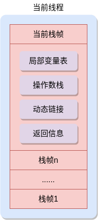

# 执行引擎

> Java虚拟机以方法作为最基本的执行单元，本节内容主要介绍执行引擎的方法调用等相关内容。

执行引擎主要与运行时数据区域和本地库接口进行交互，解析并执行字节码，它的输入是字节码，输出是执行的结果。

## 栈帧结构

栈帧是虚拟机栈中存储的元素，它可以看作是虚拟机进行方法调用和执行所依赖的一种数据结构。每个栈帧都包含一个局部变量表、操作数栈、动态连接、方法返回信息和一些附加信息。



javac编译器在编译的时候，就会计算出每个方法中的局部变量表所占槽位、操作数栈的最大深度等信息，并添加到方法表的 *Code* 属性之中。方法调用时，这些信息被包装成栈帧并入栈。

> **说明：** 每个栈帧所占用的实际内存大小，取决于方法中的程序源码和具体虚拟机实现的栈内存布局，并不受运行时变量数据的影响。

### 局部变量表

局部变量表用于存储方法参数和方法中定义的局部变量。*Code* 属性中的 *max_locals* 决定了栈帧中局部变量表的最大容量。

局部变量表的存储单位是变量槽，每个变量槽可以存放一个32位以内的数据类型（`boolean`、`byte`、`char`、`short`、`int`、`float`、`reference`和`returnAddress`），对于64位的数据类型（`long`和`double`），局部变量表使用两个连续的槽位进行存储。

`reference`类型表示一个对象实例的引用，[《Java虚拟机规范》][jvm_spec_8]中并没有说明该类型的具体结构，但是虚拟机应该能够通过这个引用完成两件事：

- 根据该引用查找到对象在堆中的存放地址或索引
- 根据该引用查找到对象所属的数据类型在方法区中存储的类型信息

`returnAddress`类型是为 *jsr*、*jsr_w*、*ret* 这三条指令服务的，指向其中一个指令的地址。这三条指令原本用于实现异常处理时的跳转，但现在已改为采用 *Code* 属性中的异常表来代替了。

Java虚拟机通过索引方式来访问局部变量表，索引值范围从0开始。对于实例方法，索引0位置存储的是方法所属的对象实例引用（即`this`）。如果访问的是64位数据类型的变量，必须同时访问第 *n* 和 *n+1* 这两个连续位置的变量槽。

局部变量表中的槽位还可以重用，这么做可以减少栈帧消耗的内存空间。局部变量表的槽位数是javac编译器根据方法中同时存在的局部变量数量和类型计算出的最大值。当方法执行超过了某个局部变量的作用范围时，其原本占用的槽位就会被重用。

### 操作数栈

操作数栈主要用于存储字节码指令的参数和执行结果，其最大深度为 *Code* 属性中 *max_stacks* 数据项的值。`long`和`double`类型数据占用2个栈容量，其他类型数据占用1个栈容量。

方法刚开始执行的时候，其对应操作数栈是空的。字节码指令会往操作数栈中写入或读取数据。调用其他方法时，也会通过操作数栈来传递方法参数。

从概念上来看，每个栈帧都是相互独立的。但是大多数虚拟机实现都会做出一些优化，使栈帧之间的一部分数据重合，让下面的栈帧中的操作数栈和上面的栈帧中的局部变量表中的部分数据重叠，这样做既可以节省空间，也可以省去方法调用时的参数传递过程。

### 动态链接

每个栈帧中都包含一个指向运行时常量池中该栈帧所属方法的引用。字节码的方法调用指令以运行时常量池中这些指向方法的符号引用作为参数。这些方法符号引用有一些会在类加载阶段或第一次调用时被解析为直接引用，这个过程称为静态解析。还有一些在每次调用时转换为直接引用，这个过程称为动态链接。

### 方法返回信息

方法调用返回只有两种情况：

- 正常调用完成（Normal Method Invocation Completion）：当执行引擎遇到方法返回的字节码指令时，就会正常调用完成。当前栈帧需要恢复到调用状态（包括局部变量表和操作数栈），并适当增加程序计数器以跳过方法调用指令，然后在调用该方法的栈帧中继续执行，并将返回值（如果有的话）压入该栈帧的操作数栈。
- 异常调用完成（Abrupt Method Invocation Completion）：当方法执行过程中遇到异常，或者使用 *athrow* 指令产生异常，就会导致异常调用完成。异常调用完成的方法不会向调用者返回任何值。

### 附加信息

Java虚拟机实现往往还会在栈帧中添加一些附加信息，例如与调试、性能收集相关的数据。

## 方法调用

方法调用的目标方法在class文件中是通过一个符号引用来表示的。方法调用并不意味着执行方法中的代码，而是确定调用哪个方法。这个确定的过程一般分为：解析和分派。

### 解析

解析调用是一个静态过程，被调用的方法在编译期间就已经确定，并在类加载的解析阶段把符号引用转化为直接引用。

Java虚拟机中设计了5个用于方法调用的字节码指令：

- *invokevirtual*：用于调用对象的实例方法，根据对象的实际类型进行分派，这是Java语言中常规的方法分派
- *invokeinterface*：用于调用接口方法，根据运行时的具体对象找到合适的实现方法进行调用
- *invokespecial*：用于调用`<init>()`方法、私有方法或父类方法
- *invokestatic*：用于调用静态方法，执行类中的静态方法
- *invokedynamic*：用于调用动态方法，在运行时动态解析出调用点限定符所引用的方法，然后再执行该方法

其中，被 *invokestatic* 和 *invokespecial* 指令调用的方法（包括共有静态方法、私有方法、`<init>()`方法、父类方法），都可以在类加载的解析阶段确定唯一的版本，把符号引用转化为直接引用。被`final`修饰的方法（虽然使用 *invokevirtual* 指令调用）也可以被解析为直接引用，因为它不能被子类重写，只存在唯一的版本。

**示例：** 如下代码用于演示静态解析。`StaticResolution`类中定义了一个静态方法`resolution()`，然后在`main()`方法中调用

```java
public class StaticResolution {

    public static void main(String[] args) {
        resolution();
    }

    public static void resolution() {
        System.out.println("static resolution");
    }
}
```

先使用`javac StaticResolution.java`命令生成class文件，再使用`javap -v StaticResolution.class`命令查看，可以发现`resolution()`方法的确是通过 *invokestatic* 指令调用的，且调用的方法版本在编译期间就已经明确（常量池中第2号数据项）。

```text
public static void main(java.lang.String[]);
  descriptor: ([Ljava/lang/String;)V
  flags: (0x0009) ACC_PUBLIC, ACC_STATIC
  Code:
    stack=0, locals=1, args_size=1
       0: invokestatic  #2                  // Method resolution:()V
       3: return
    LineNumberTable:
      line 10: 0
      line 11: 3
```

有些情况下，例如方法的参数类型是基本类型，没有显式的静态类型，方法的重载版本可能并不唯一，javac编译器只能根据特定的优先级来匹配“最合适”的版本。

**示例：** 如下代码用于演示重载方法的匹配优先级

```java
public class Overload {

    public static void hello(char arg) {
        System.out.println("hello char");
    }

    public static void hello(int arg) {
        System.out.println("hello int");
    }

    public static void hello(long arg) {
        System.out.println("hello long");
    }

    public static void hello(float arg) {
        System.out.println("hello float");
    }

    public static void hello(double arg) {
        System.out.println("hello double");
    }

    public static void hello(Character arg) {
        System.out.println("hello Character");
    }

    public static void hello(Serializable arg) {
        System.out.println("hello Serializable");
    }

    public static void hello(Object arg) {
        System.out.println("hello object");
    }

    public static void hello(char... arg) {
        System.out.println("hello char...");
    }

    public static void main(String[] args) {
        hello('a');
    }
}
```

上述代码执行结果为：

```text
hello char
```

说明调用的方法是`hello(char arg)`，但是如果将该方法注释掉，重新运行后发现结果为：

```text
hello int
```

这说明发生了自动类型转换，`'a'`既可以表示`char`类型数据，也可以表示`int`类型数据97。

上述示例中，依次将调用的方法注释掉，执行的结果都会发生变化，这说明`hello()`方法的重载版本不止一个。从该示例中，可以发现重载方法的匹配优先级为：

`char` -> `int` -> `long` -> `float` -> `double` -> 自动装箱类型`Character` -> 自动装箱类型所实现的接口`Serializable` -> `Object` -> 可变长度参数方法

### 分派

Java中的方法支持重载（Overload）和重写（Override）。对于重载或重写的方法，通过分派来确定方法执行的版本。

#### 静态分派

Java中方法的重载通过静态分派来确定执行的版本。所有依赖静态类型来决定方法执行版本的分派动作，都称为静态分派。静态分派发生在编译阶段，并不是由虚拟机来执行的。

对于重载的方法，在确定方法调用者类型的前提下，使用哪个版本取决于方法参数的数量和类型。而方法中参数的静态类型在编译期间就已经确定，因此javac编译器在编译期间就根据参数的静态类型确定了方法执行的版本。

**示例：** 如下代码用于演示和说明静态分派。`print()`方法有三个重载版本。变量`list1`和`list2`的的静态类型都是`List`，而实际类型分别是`ArrayList`和`LinkedList`。

```java
public class MethodOverloadResolution {

    public static void main(String[] args) {
        MethodOverloadResolution resolution = new MethodOverloadResolution();
        List<String> list1 = new ArrayList<>();
        List<String> list2 = new LinkedList<>();
        resolution.print(list1);
        resolution.print(list2);
    }

    public void print(List<String> list) {
        System.out.println("print List");
    }

    public void print(ArrayList<String> list) {
        System.out.println("print ArrayList");
    }

    public void print(LinkedList<String> list) {
        System.out.println("print LinkedList");
    }
}
```

上述代码执行结果如下：

```text
print List
print List
```

使用`javap -v`命令查看上述示例代码，可以发现调用的`print()`方法（第26和31行）的入参是`Ljava/util/List;`，这说明对于重载的方法，javac在编译期间就通过变量的静态类型确定了方法的版本。

```text
public static void main(java.lang.String[]);
  descriptor: ([Ljava/lang/String;)V
  flags: ACC_PUBLIC, ACC_STATIC
  Code:
    stack=2, locals=4, args_size=1
       0: new           #2                  // class org/jvm/execution/MethodOverloadResolution
       3: dup
       4: invokespecial #3                  // Method "<init>":()V
       7: astore_1
       8: new           #4                  // class java/util/ArrayList
      11: dup
      12: invokespecial #5                  // Method java/util/ArrayList."<init>":()V
      15: astore_2
      16: new           #6                  // class java/util/LinkedList
      19: dup
      20: invokespecial #7                  // Method java/util/LinkedList."<init>":()V
      23: astore_3
      24: aload_1
      25: aload_2
      26: invokevirtual #8                  // Method print:(Ljava/util/List;)V
      29: aload_1
      30: aload_3
      31: invokevirtual #8                  // Method print:(Ljava/util/List;)V
      34: return
```


#### 动态分派

Java中方法的重写通过动态分派来确定执行的版本。在运行期根据实际类型来确定方法执行版本的分派过程称为动态分派。动态分派过程是由Java虚拟机在运行时执行的。

**示例：** 如下代码用于演示动态分派。变量`father`和`son`的静态类型都是`Father`，实际类型分别是`Father`和`Son`。

```java
public class DynamicDispatch {

    public static void main(String[] args) {
        Father father = new Father();
        father.print();
        Father son = new Son();
        son.print();
    }

    public static class Father {
        protected void print() {
            System.out.println("father print");
        }
    }

    public static class Son extends Father {
        protected void print() {
            System.out.println("son print");
        }
    }
}
```

上述代码执行结果如下：

```text
father print
son print
```

使用`javap -v`命令查看，可以发现`father.print()`和`son.print()`这两句代码在编译后对应的指令都是 *invokevirtual*（第9和21行），方法调用者的静态类型也一样，但是结果却不一样，这说明是 *invokevirtual* 指令导致了不同的结果。

```text
public static void main(java.lang.String[]);
  descriptor: ([Ljava/lang/String;)V
  flags: ACC_PUBLIC, ACC_STATIC
  Code:
    stack=2, locals=3, args_size=1
       0: new           #2                  // class org/jvm/execution/DynamicDispatch$Father
       3: dup
       4: invokespecial #3                  // Method org/jvm/execution/DynamicDispatch$Father."<init>":()V
       7: astore_1
       8: aload_1
       9: invokevirtual #4                  // Method org/jvm/execution/DynamicDispatch$Father.print:()V
      12: new           #5                  // class org/jvm/execution/DynamicDispatch$Son
      15: dup
      16: invokespecial #6                  // Method org/jvm/execution/DynamicDispatch$Son."<init>":()V
      19: astore_2
      20: aload_2
      21: invokevirtual #4                  // Method org/jvm/execution/DynamicDispatch$Father.print:()V
      24: return
```

*invokevirtual* 指令的解析过程大致如下：

1. 找到操作数栈顶的第一个元素所指向的对象的实际类型C
1. 如果在类型C中找到与常量池中的描述符和简单名称都相符的方法，则进行访问权限校验。如果通过，则返回这个方法的直接引用；如果不通过，则抛出`java.lang.IllegalAccessError`异常
1. 否则，按照继承关系从下往上依次对C的各个父类重复步骤2的查找过程
1. 如果始终没有找到合适的方法，则抛出`java.lang.AbstractMethodError`异常

由此可以看出上述代码示例中，*invokevirtual* 指令执行时第一步就是找出方法调用者的实际类型，然后在实际类型中查找方法，因此导致执行结果不一样。

在实际情况中，虚拟机的动态分派是一个非常频繁的动作，而在动态分派的过程中需要在方法调用者类型的元数据中查找匹配的目标方法，这显然比较耗费性能。因此，Java虚拟机实现中，一般不会每次都重复查找这些类型数据，而是在方法区中建立一个虚方法表（Virtual Method Table），用于存放各个方法的实际入口地址，并使用索引来代替查找过程以提高性能。

[jvm_spec_8]: https://docs.oracle.com/javase/specs/jvms/se8/html/index.html
