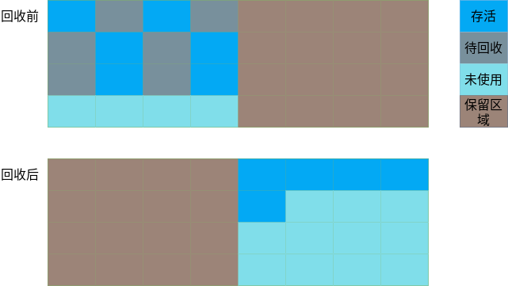

# 内存管理

> 自动内存管理子系统是Java虚拟机实现必不可少的组成部分，本节内容主要介绍对象在内存中的布局、创建和访问，以及垃圾回收等相关内容。

## 内存中的对象

Java虚拟机自动内存管理的主要内容就是堆内存中的对象。

### 对象内存布局

在HotSpot虚拟机中，对象在堆内存中的存储布局可以分为三个部分：

- 对象头（Header）：存储Mark Word和类型指针信息

- 实例数据（Instance Data）：存储类中定义的字段

- 对齐填充（Padding）：对齐补全，不一定存在

#### 对象头

对象头中的Mark Word用于存储对象自身的运行时数据，如：哈希码（HashCode）、GC分代年龄、锁状态标志、线程持有的锁、偏向线程ID、偏向时间戳等。Mark Word在32位和64位虚拟机中分别占用32 bit（4字节）和64 bit（8字节）。在32位虚拟机中，Mark Word的存储内容如下表所示：

<table>
    <tr><th>锁状态</th><th colspan="4" align="center">存储内容（30bit）</th><th>锁标志位（2bit）</th></tr>
    <tr><td>无锁</td><td colspan="2" align="center">对象哈希码（25bit）</td><td>GC分代年龄（4bit）</td><td>偏向标志（1bit）：0</td><td>01</td></tr>
    <tr><td>偏向锁</td><td>偏向线程ID（23bit）</td><td>偏向线程时间戳（2bit）</td><td>GC分代年龄（4bit）</td><td>偏向标志（1bit）：1</td><td>01</td></tr>
    <tr><td>轻量级锁</td><td colspan="4" align="center">指向锁记录的指针</td><td>00</td></tr>
    <tr><td>重量级锁</td><td colspan="4" align="center">指向重量级锁的指针</td><td>10</td></tr>
    <tr><td>GC标记</td><td colspan="4" align="center">空，不需要记录信息</td><td>11</td></tr>
</table>

对象头中的另一部分信息是类型指针，指向对象类型的元数据，虚拟机通过这个指针来确定对象类型。在32位和64位虚拟机中，类型指针分别占用4字节和8字节，如果开启指针压缩，则占用4字节。

> **说明：** 指针压缩（`-XX:+/-UseCompressedOops`）参数只有64位的HotSpot虚拟机才支持。当虚拟机的堆内存小于32G时，默认开启。

如果对象是一个数组，对象头中还必须记录数组的长度，因为虚拟机可以通过普通对象的元数据信息确定对象的大小，但是却无法通过元数据中的信息推断出数组的大小。在32位和64位虚拟机中，数组长度分别占用4字节和8字节，如果开启指针压缩，则占用4字节。

#### 实例数据

实例数据用于存储类中定义的各个字段（非静态），包括从父类中继承的。虚拟机不会按照字段在类中声明的顺序来分配空间，而是进行重排序，且父类中的字段在子类字段之前分配，普通对象指针（Ordinary Object Pointers，Oops）最后分配。在32位和64位虚拟机中，普通对象指针分别占用4字节和8字节，如果开启指针压缩，则占用4字节。

#### 对齐填充

对齐填充起占位符的作用。HotSpot虚拟机的自动内存管理系统要求对象起始地址必须是8字节的整数倍，因此任何对象占用的内存大小必须是8字节的整数倍。如果对象头和实例数据占用的总字节不是8的整数倍，就需要对齐填充。

对齐填充包含两部分：

- 如果一个对象的对象头和实例数据占用的总内存空间没有达到8的整数倍时，就会进行对齐填充，将占用空间补全到最接近的8的整数倍字节。
- 字段与字段之间也会进行对齐填充，对齐的宽度为4字节。

**示例：** 如下代码用于演示对象的内存布局，需要先引入JOL（Java Object Layout）工具，通过Maven在pom文件中添加如下依赖：

```xml
<dependency>
    <groupId>org.openjdk.jol</groupId>
    <artifactId>jol-core</artifactId>
    <version>0.8</version>
</dependency>
```

然后执行如下代码：

```java
public class MemoryLayout {
    private byte aByte;
    private int anInt;
    private char aChar;
    public long aLong;
    public SubMemoryLayout sub;
    public static double aDouble;
}

public class SubMemoryLayout extends MemoryLayout {
    private MemoryLayout parent;
    private boolean aBoolean;
    private short aShort;
    private float aFloat;
    public double aDouble;

    public static void main(String[] args) {
        SubMemoryLayout layout = new SubMemoryLayout();
        System.out.println(ClassLayout.parseInstance(layout).toPrintable());
    }
}
```

打印结果如下所示：

```text
org.jvm.memory.SubMemoryLayout object internals:
 OFFSET  SIZE                             TYPE DESCRIPTION                               VALUE
      0     4                                  (object header)                           01 00 00 00 (00000001 00000000 00000000 00000000) (1)
      4     4                                  (object header)                           00 00 00 00 (00000000 00000000 00000000 00000000) (0)
      8     4                                  (object header)                           42 c1 00 f8 (01000010 11000001 00000000 11111000) (-134168254)
     12     4                              int MemoryLayout.anInt                        0
     16     8                             long MemoryLayout.aLong                        0
     24     2                             char MemoryLayout.aChar                         
     26     1                             byte MemoryLayout.aByte                        0
     27     1                                  (alignment/padding gap)                  
     28     4   org.jvm.memory.SubMemoryLayout MemoryLayout.sub                          null
     32     8                           double SubMemoryLayout.aDouble                   0.0
     40     4                            float SubMemoryLayout.aFloat                    0.0
     44     2                            short SubMemoryLayout.aShort                    0
     46     1                          boolean SubMemoryLayout.aBoolean                  false
     47     1                                  (alignment/padding gap)                  
     48     4      org.jvm.memory.MemoryLayout SubMemoryLayout.parent                    null
     52     4                                  (loss due to the next object alignment)
Instance size: 56 bytes
Space losses: 2 bytes internal + 4 bytes external = 6 bytes total
```

可以发现，对象的实例数据中包含父类中所有的`private`修饰的非静态字段，且父类字段先分配内存，引用类型字段最后分配内存。

### 对象创建

在Java语言中，通过`new`关键字创建对象是最常见的方式。除此之外，还可以通过反射（`Class`或`Constructor`类的`newInstance()`方法）、反序列化、Clone等方式创建对象。

#### 创建过程

使用`new`关键字创建一个普通对象（非数组）的过程中，虚拟机会执行如下步骤：

1. 先检查 *new* 指令是否能在运行时常量池中定位到这个类的符号引用
1. 检查这个符号引用代表的类是否已被加载、解析、初始化过，如果没有，则先进行类加载
1. 类加载完成之后，虚拟机就可以确定对象的大小，然后在堆中为对象分配内存
1. 内存分配完成后，虚拟机必须为实例数据中各字段占用的空间初始化零值，这个步骤保证了Java对象中的实例字段不用显式地赋值就可以直接使用。
1. 对对象头进行必要的设置（对象的GC分代年龄、锁标识、类型指针等）

从虚拟机的角度来看，上述步骤执行完成之后，对象就已经创建完成。但是从Java程序的角度来看，对象还没有初始化，因为构造函数（`<init>()`方法）还没有执行，所有的实例字段都只是默认的零值。一般情况下，javac编译器会在遇到`new`关键字的地方同时生成 *new* 和 *invokespecial* 这两条指令，*invokespecial* 指令用于执行`<init>()`方法，将对象按照程序进行初始化。

#### 内存分配

创建对象过程中的内存分配实际上是把一块确定大小的内存区域从堆中划分出来。

内存分配的方式一般有两种：

- 指针碰撞：如果堆内存是绝对规整的，所有已使用的内存在一边，空间内存在另一边，中间放一个指针作为临界点指示器，那么内存分配只需要将指示器向空闲内存移动与对象大小相等的空间就可以了。
- 空闲列表：如果内存空间不规整，已使用内存和空闲内存混在一起，虚拟机就必须维护一个列表，记录哪些内存块是空闲的，分配时从列表中找一块足够大的空间分配给对象。

选择哪一种内存分配方式取决于堆内存空间是否规整，而堆内存是否规整取决于垃圾收集器是否带有压缩整理功能。

堆是所有线程共享的区域，因此内存分配也会存在并发安全问题。对于这个问题，也有两种解决方式：

- 使用CAS（Compare And Swap，比较替换）和失败重试的方式对内存分配进行同步处理，从而保证操作的原子性
- 本地线程分配缓冲（Thread Local Allocation Buffer，TLAB），每个线程预先在堆中分配一块内存，然后把内存分配动作划分到不同的线程缓冲区中进行，只有当本地线程缓冲区用完时才进行同步锁定。可以使用`-XX:+/-UseTLAB`参数来设置是否使用TLAB

### 对象访问

Java虚拟机中通过 *reference* 类型数据来访问引用类型对象，但是[《Java虚拟机规范》][jvm_spec_8]中只规定它是一个指向对象的引用，并没有规定该类型的具体结构以及如何去定位和访问对象。因此，对象的访问方式取决于具体的虚拟机实现。

主流的对象访问有两种方式：句柄访问和直接指针访问。

#### 句柄访问

如果使用句柄访问对象，堆中会划分出一块内存作为对象访问的句柄池。*reference* 类型存储句柄地址，每个句柄都包含对象实例数据和类型数据的地址信息，分别指向堆中的对象实例数据和方法区中的对象类型数据，如下图所示：


使用句柄访问对象的一个好处是：对象移动后，不需要修改 *reference* 中存储的句柄地址，只要修改句柄中的对象实例指针就行。

#### 直接指针访问

如果使用直接指针访问对象，*reference* 中存储的是对象地址，且对象的内存布局中需要包含对象类型指针，如下图所示：


相对于句柄访问，使用直接指针访问对象的一个好处就是快，因为它省去了一次指针定位的耗时。HotSpot虚拟机主要采用直接指针访问对象。

### 对象引用

在JDK1.2及以后，Java中的引用分为4种：

- 强引用（Strong Reference）：类似`Object obj = new Object()`这种引用关系就是强引用。无论在什么情况下，只要对象还存在强引用关系，垃圾回收器就不会将其回收。
- 软引用（Soft Reference）：用于描述仍然有用，但非必须的对象。内存空间足够时，软引用对象不会被回收；内存空间不足时，虚拟机在抛出`OutOfMemoryError`异常之前会先将软引用对象列入回收范围进行第二次回收。根据这种特性，软引用可以用于某些缓存技术的实现，尽量避免OOM。在JDK1.2之后，可以使用`java.lang.ref.SoftReference`来实现软引用。
- 弱引用（Weak Reference）：用于描述非必须的对象。弱引用对象存活时间一般比软引用对象短。下一次垃圾回收发生时，不管内存是否足够，弱引用对象都会被回收。在JDK1.2之后，可以使用`java.lang.ref.WeakReference`来实现弱引用。
- 虚引用（Phantom Reference）：又称为“幻引用”或“幽灵引用”，无法通过虚引用获得对象实例。为一个对象设置虚引用的唯一目的只是为了能在这个对象被收集器回收的时候收到一个系统通知。在JDK1.2之后，可以使用`java.lang.ref.PhantomReference`来实现虚引用。

`SoftReference`、`WeakReference`、`PhantomReference`都可以和引用队列（`java.lang.ref.ReferenceQueue`）配合使用。当垃圾回收器准备回收一个对象时，如果发现它还有这些引用，会在回收对象之前，把这个引用加入到与之关联的引用队列中去。

虚引用必须与引用队列一起引用，`PhantomReference`只有一个构造方法，包含一个引用对象和一个引用队列对象作为构造参数。

```java
public PhantomReference(T referent, ReferenceQueue<? super T> q) {
    super(referent, q);
}
```

而`SoftReference`、`WeakReference`都有两个构造方法，可以只接受一个对象引用作为构造参数。

```java
public SoftReference(T referent) {
    super(referent);
    this.timestamp = clock;
}

public WeakReference(T referent) {
    super(referent);
}
```

## 垃圾回收

Java虚拟机中的垃圾回收机制使得Java开发人员可以从繁杂的内存管理中解脱出来，只关注程序功能本身。

### 垃圾回收区域

在Java虚拟机的内存区域中，程序计数器、虚拟机栈、本地方法栈这三块区域的内存分配和回收都具备确定性，因此并非垃圾收集器重点关注的区域。垃圾收集器关注的主要内存区域是堆和方法区。

#### 堆内存回收

堆内存中存储的主要是运行时产生的对象实例和数组，垃圾收集器在对堆进行回收之前，首先要确定对象是否存活，只有已经“死亡”的对象才会被收集器回收。对象死亡判定常用的方式是：引用技术算法和可达性分析算法。

##### 引用计数算法

引用计数算法是在对象中添加一个引用计数器，当该对象被引用时，计数值+1；引用失效时，计数值-1。当引用计数器的值为0时，表示对象不再被引用。

引用计数算法的优点是判定方式简单高效，缺点是需要频繁计数，增加CPU消耗，且无法解决循环引用问题。

**示例：** 如下代码中，`a`和`b`两个对象互相引用，除此之外，再无任何引用，它们的引用计数都不为0，使用引用计数算法的虚拟机就无法回收它们。

```java
public class CycleReference {
    public CycleReference reference;
    public static void main(String[] args) {
        CycleReference a = new CycleReference();
        CycleReference b = new CycleReference();
        a.reference = b;
        b.reference = a;
        a = null;
        b = null;
        System.gc();
    }
}
```

通过`-XX:+PrintGCDetails`参数打印垃圾回收详情：

```text
[GC (System.gc()) [PSYoungGen: 3343K->792K(38400K)] 3343K->800K(125952K), 0.0013079 secs] [Times: user=0.00 sys=0.00, real=0.00 secs] 
[Full GC (System.gc()) [PSYoungGen: 792K->0K(38400K)] [ParOldGen: 8K->673K(87552K)] 800K->673K(125952K), [Metaspace: 3256K->3256K(1056768K)], 0.0079711 secs] [Times: user=0.00 sys=0.00, real=0.00 secs] 
Heap
 PSYoungGen      total 38400K, used 998K [0x00000000d5e00000, 0x00000000d8880000, 0x0000000100000000)
  eden space 33280K, 3% used [0x00000000d5e00000,0x00000000d5ef9b58,0x00000000d7e80000)
  from space 5120K, 0% used [0x00000000d7e80000,0x00000000d7e80000,0x00000000d8380000)
  to   space 5120K, 0% used [0x00000000d8380000,0x00000000d8380000,0x00000000d8880000)
 ParOldGen       total 87552K, used 673K [0x0000000081a00000, 0x0000000086f80000, 0x00000000d5e00000)
  object space 87552K, 0% used [0x0000000081a00000,0x0000000081aa86c0,0x0000000086f80000)
 Metaspace       used 3263K, capacity 4496K, committed 4864K, reserved 1056768K
  class space    used 340K, capacity 388K, committed 512K, reserved 1048576K
```

从结果来看，[PSYoungGen: 792K->0K(38400K)] 说明这两个对象已经被回收，这也说明HotSpot虚拟机并非使用引用计数算法来判定对象是否死亡的。

##### 可达性分析算法

可达性分析算法（Reachability Analysis）通过一系列的称为GC Roots的对象作为起始点集合，从这些起始节点开始向下搜索，节点走过的路径称为引用链（Reference Chain），如果某个对象到GC Roots之间没有任何引用链相连，则证明此对象不可能再被引用。

相对于引用技术算法，可达性分析算法更加准确，可以很好地解决对象循环引用的问题，但是判定过程更加复杂。

如下图所示，绿色对象与GC Roots对象有关联，因此虚拟机进行可达性分析时判定它们仍然存活，而灰色对象与GC Roots对象没有关联，则他们被判定为可回收。


在Java中，可以作为GC Roots的对象主要包括如下几类：

- 栈帧的本地变量表中引用的对象，如当前线程正在被调用的方法中的参数、局部变量等
- 方法区中类静态字段引用的对象
- 方法区中常量引用的对象
- 本地方法栈中JNI（即本地方法）引用的对象
- Java虚拟机内部的引用，如基本类型对应的`Class`对象，一些常驻的异常（`NullPointerException`、`OutOfMemoryError`）对象等，以及应用类加载器
- 被同步锁（`synchronized`关键字）持有的对象
- 反映Java虚拟机内部情况的JMXBean、JVMTI中注册的回调、本地代码缓存等

可达性分析中被标记为不可达的对象也并非一定会被回收。一个对象真正死亡，至少要经过两次标记过程：

1. 可达性分析之后，与GC Roots对象没有关联的对象会被第一次标记，并进行一次筛选，筛选的条件是：是否需要执行`finalize()`方法
1. 如果对象被判定为需要执行`finalize()`方法，它会被存到一个队列中，由一个低优先级的Finalizer线程去执行它的`finalize()`方法。垃圾收集器会对该队列中的对象进行第二次小范围标记，如果对象在`finalize()`方法中重新与GC Roots关联，它就不会被回收；否则，它就会被真的回收

如果一个对象的`finalize()`方法没有被覆盖，或者`finalize()`方法没有被执行过，虚拟机会认为它不需要执行`finalize()`方法。

**示例：** 如下代码演示对象通过`finalize()`方法逃逸的过程

```java
public class FinalizeEscape {

    public static FinalizeEscape escape = new FinalizeEscape();

    @Override
    protected void finalize() throws Throwable {
        super.finalize();
        System.out.println("finalize method executed");
        // 将this赋值给对象，使其重新跟GC Roots关联
        escape = this;
    }

    public static void tryEscape() throws InterruptedException {
        // 赋值为null，使垃圾收集器对其进行收集
        escape = null;
        System.gc();
        // 等待Finalize线程去执行被重写的finalize()方法
        Thread.sleep(1000L);

        if (escape != null) {
            System.out.println("escape successfully");
        } else {
            System.out.println("escape failed");
        }
    }

    public static void main(String[] args) throws InterruptedException {
        // 第一次逃逸
        tryEscape();
        // 第二次逃逸
        tryEscape();
    }
}
```

执行结果如下：

```text
finalize method executed
escape successfully
escape failed
```

可以发现，`escape`对象第一次逃逸成功，第二次逃逸失败，这是因为任何对象的`finalize()`方法都只会被虚拟机自动调用一次。

#### 方法区回收

方法区中回收的内容主要有两部分：废弃的常量和不再使用的类型。

当常量池中的常量不再被任何地方引用时，垃圾收集器就会将其进行回收（包括类或接口、方法、字段的符号引用等）。

而要判定一个类型不再被使用，则需要同时满足下面三个条件：

- 该类所有的实例都已经被回收，也就是Java堆中不存在该类及其任何派生子类的实例。
- 加载该类的类加载器已经被回收，这个条件除非是经过精心设计的可替换类加载器的场景，如OSGi、JSP的重加载等，否则通常是很难达成的。
- 该类对应的`java.lang.Class`对象没有在任何地方被引用，无法在任何地方通过反射访问该类的方法。

HotSpot虚拟机提供了`-Xnoclassgc`参数控制是否对方法区中的类型进行回收，还可以使用`-verbose:class`参数和`-XX:+TraceClassUnLoading`参数查看类加载和卸载的信息。

### 垃圾回收算法

垃圾回收算法解决的是如何回收的问题。现在主流虚拟机中的垃圾收集器都基于“分代收集理论”来实现，常见的垃圾回收算法有：

- 标记清除算法
- 标记复制算法
- 标记整理算法

#### 分代收集理论

分代收集理论建立在三个假说之上：

- 弱分代假说：大多数对象都是朝生夕灭的
- 强分代假说：熬过越多次垃圾收集过程的对象就越难以消亡
- 跨代引用假说：跨代引用相对于同代引用来说仅占极少数

基于弱分代假说和强分代假说，垃圾收集器应该将堆内存划分出不同的区域，根据对象年龄（对象熬过的垃圾收集次数）将其分配到不同的区域中存储，这样垃圾收集器就可以只针对某个区域单独进行回收。常用的垃圾收集器一般会将堆内存划分为：新生代（Young Generation）和永久代（Tenured Generation），针对这两个区域的垃圾回收过程分别称为：新生代收集（Minor GC）和永久代收集（Major GC）。

基于跨代引用假说，虚拟机就不应该为了少量的跨代引用去扫描整个永久代，只需要建立一个全局的数据结构（记忆集，Remembered Set）。这个记忆集将永久代分为若干小块，并标记出哪些小块存在跨代引用。这样在发生Minor GC时，只有存在跨代引用的小块内存会进行GC Roots扫描，节省了耗时。

关于分代收集的一些名词解释如下：

- 部分收集（Partial GC）：对部分堆内存进行垃圾回收，其中又分为新生代收集和永久代收集
- 新生代收集（Minor GC/Young GC）：只对新生代进行垃圾回收
- 永久代收集（Major GC/Old GC）：只对永久代进行垃圾回收。目前只有CMS收集器会有单独收集永久代的行为
- 混合收集（Mixed GC）：对新生代以及部分永久代进行垃圾回收。目前只有G1收集器会有这种行为
- 整堆收集（Full GC）：对整个堆和方法区进行垃圾回收

#### 标记清除算法

标记清除算法是最基础的垃圾收集算法，它分为两个过程：

- 标记：标记出需要回收或不能回收的对象，这个过程其实就是对象死亡判定的过程
- 清除：回收掉需要被回收的对象

标记清除算法执行效果如下图所示：


标记清除算法的缺点有两个：

- 执行效率不稳定，标记清除的效率就会随着对象数量的增长而降低
- 内存空间碎片化，清除后的内存空间不连续，导致后续程序需要分配大的内存空间时因为找不到足够大的连续内存空间而引发另一次垃圾回收

#### 标记复制算法

标记复制算法将可用内存按容量划分为大小相等的两块，一块用于给对象分配空间，一块空闲。当其中一块用完时，将存活的对象复制到另一块，然后把已使用这一块全部清理掉。

标记复制算法执行效果如下图所示：



标记复制算法的优点是：只针对一半的堆内存进行回收，执行效率高，而且不会有内存碎片。缺点也很明显：可用内存空间缩小为原来的一半。

由于新生代中的大部分对象都熬不过第一轮垃圾回收，因此并不需要按照1:1的比例来划分新生代的内存空间。HotSpot虚拟机中的Serial、ParNew等新生代收集器采用了一种更优化的半区复制策略（Appel式回收）来设计新生代的内存布局。Appel式回收的具体做法是把新生代分为一块较大的Eden空间和两块较小且一样大的Survivor空间（S0和S1），每次分配内存只使用Eden和其中一块Survivor。垃圾回收时，将Eden和Survivor中仍然存活的对象一次性复制到另外一块Survivor空间上，然后直接清理掉Eden和已用过的Survivor空间。

> **说明：** HotSpot虚拟机中，可以通过`-XX:SurvivorRatio`参数设置Eden空间和Survivor空间的比率，默认值为8。

#### 标记整理算法

标记整理算法会在标记完成之后，将存活对象进行整理，向内存空间的一端移动，从而消除内存碎片。

标记整理算法执行效果如下图所示：


标记整理算法的一个缺点是：当内存中存活的对象较多时（如永久代），移动存活对象并更新所有引用这些对象的地方将会是一种极为负重的操作。

## HotSpot中的垃圾回收细节

在了解了垃圾回收区域和垃圾回收算法之后，本小节内容结合HotSpot虚拟机的实现细节来更详细地说明垃圾回收的过程。

### 根节点枚举

虽然可以作为GC Roots的对象是明确的，但是要将所有的GC Roots对象高效地枚举出来却并非易事。根节点枚举就是找出所有GC Roots对象的过程。现在的垃圾收集器，在根节点枚举这一步骤中都必须暂停用户线程（这个动作称为：Stop The World，STW）。

为了高效地完成根节点枚举，虚拟机需要直接知道哪些地方存放着对象引用。HotSpot虚拟机是通过一组称为OopMap的数据结构来达到这个目的。类加载动作完成的时候，HotSpot就会把对象中哪个偏移量上是什么类型的数据计算出来，在即时编译过程中，也会在特定的位置记录下虚拟机栈和程序计数器中哪些位置是引用。这样收集器在扫描时就可以直接得知这些信息了，并不需要真正一个不漏地从方法区等GC Roots开始查找。

### 安全点

可以导致OopMap内容变化的指令有很多，但是HotSpot并没有为每条指令都生成OopMap，而是在特定的位置记录了这些信息，这些“特定的位置”被称为安全点（Safepoint）。

HotSpot虚拟机在接收到GC信号的时候，并非在任意位置都可以立即停下来的，而是必须执行到安全点才能够暂停用户线程。HotSpot中将方法调用、循环跳转、异常跳转等这些可能导致程序需要一段较长时间执行的指令作为安全点。

虚拟机在接到GC信号时，要让各个用户线程都跑到安全点并中断，通常有两种方式：

- 主动式中断：当垃圾收集需要中断线程的时候，并不直接对线程操作，仅仅简单地设置一个标志位，各个线程执行过程时会不停地主动去轮询这个标志，一旦发现中断标志为真时就自己在最近的安全点上主动中断挂起。轮询标志的地方和安全点是重合的，另外还要加上所有创建对象和其他需要在Java堆上分配内存的地方，这是为了检查是否即将要发生垃圾收集，避免没有足够内存分配新对象。
- 抢先式中断：立即中断所有线程，如果发现某个用户线程中断的地方不在安全点上，就恢复这条线程执行，直到跑到安全点再重新中断。现在几乎没有虚拟机实现采用抢先式中断来暂停用户线程。

### 安全区域

安全区域指能够确保引用关系不会发生变化的某一段代码区域，在这个区域中任意地方开始垃圾收集都是安全的。

当用户线程执行到安全区域中的代码时，首先会标识已经进入到安全区域，这也虚拟机要发起垃圾收集时就不必去管这些已声明处于安全区域内的线程了。当线程要离开安全区域时，它要检查虚拟机是否已经完成了根节点枚举，如果已经完成了，那线程就当作没事发生过，继续执行；否则它就必须一直等待，直到收到可以离开安全区域的信号为止。

### 记忆集与卡表

记忆集是一种用于记录从非收集区域指向收集区域的指针集合的抽象数据结构。按照记忆集的实现方式来看，它的记录一般可以分为三种不同的精度：

- 字长精度：每个记录精确到一个机器字长（就是处理器的寻址位数，如常见的32位或64位，这个精度决定了机器访问物理内存地址的指针长度），该字包含跨代指针。
- 对象精度：每个记录精确到一个对象，该对象里有字段含有跨代指针。
- 卡精度：每个记录精确到一块内存区域，该区域内有对象含有跨代指针。

其中，卡精度是指以一种称为卡表（Card Table）的方式去实现记忆集。卡表可以是一个数组，每个元素都是一个字节的标志位，且都对应一个特定大小的内存块，称为卡页（Card Page）。当卡表中某个元素对应的内存块中存在跨代指针，就将该元素的值标识为1（变脏），没有则标识为0。垃圾回收时，只要选出卡表中变脏的元素，就能知道哪些内存块包含跨代指针，把它加入GC Roots一起扫描。

卡表的结构如下图所示，Card 2的值为1，说明Page 2所表示的内存块中（0x0200~0x03FF这块区域）有跨代引用。


> **说明：** 在HotSpot虚拟机中，每个卡页的大小为512字节。

### 写屏障

卡表可以很好地缩小GC Roots的扫描范围，但是如何维护卡表状态（更新卡表数据）就成了一个新的问题。在HotSpot虚拟机中是通过写屏障（Write Barrier）技术维护卡表状态的。写屏障可以看作是一个切面，应用写屏障之后，虚拟机会为所有赋值操作生成相应指令，当引用类型对象赋值时，如果引用的是另一个内存区域的对象，就会产生一个环绕通知，告诉虚拟机需要更新卡表。

在赋值前的写屏障叫作写前屏障（Pre-Write Barrier），在赋值后的则叫作写后屏障（Post-Write Barrier）。HotSpot虚拟机中的很多垃圾收集器都用到了写屏障，但是直到G1收集器出现之前，其他收集器都只用到了写后屏障。

### 并发可达性分析

从理论上来说，可达性分析算法的全过程都必须暂停用户线程，这样才能保证分析结果的正确性。在根节点枚举过程中，通过各种优化技术（如OopMap），用户线程的停顿已经非常短暂，但是从GC Roots对象开始查找引用链的过程，用户停顿时间就跟几乎堆内存容量成正比了（对象越多，查找引用链耗时越久）。

并发的可达性分析指用户线程与查找引用链的过程并发执行。采用并发可达性分析时，如果将一个原本存活的对象错误标记为死亡，问题就非常严重了。为了保证并发可达性分析的正确性（或者说保证对象不会被错误标记为死亡），有两种方式：

- 增量更新：在并发扫描的过程中，如果某个存活的对象引用了一个不可达（死亡）对象，就将这个引用记录下来，等并发扫描结束后，再以这个存活对象为根节点，重新扫描一次。
- 原始快照（SATB）：如果某个对象已被扫描过，但是还存在至少一个未被扫描的引用，在并发扫描的情况下，如果这个对象要删除指向不可达对象的引用关系时，就将这个要删除的引用记录下来，在并发扫描结束之后，再将这些记录过的引用关系中的灰色对象为根节点，重新扫描一次。

## 垃圾收集器

HotSpot虚拟机中的垃圾收集器如下图所示：


Serial、ParNew、Parallel Scavenge收集器负责回收新生代，而Serial Old、CMS、Parallel Old收集负责回收永久代。图中实线表示对应的垃圾收集器可以组合使用，而虚线则表示在JDK8中已经不建议这样组合使用，在JDK9中已经取消了这样的组合支持。

纵观HotSpot虚拟机中垃圾收集器的发展历史，可以发现其大致脉络为：串行 -> 并行 -> 并发。串行阶段，Serial和Serial Old收集器都使用单个GC线程回收垃圾；并行阶段，ParNew、Parallel Scavenge和Parallel Old收集器可以使用多个GC线程回收垃圾；到了并发阶段，CMS、G1收集器允许GC线程和用户线程同时工作。

### Serial与Serial Old收集器

Serial收集器与Serial Old收集器都只用一个GC线程进行垃圾回收，而且垃圾收集期间必须暂停所有用户线程。Serial收集器和Serial Old收集器的垃圾回收过程如下图所示：


其中，Serial收集器采用标记复制算法回收新生代，而Serial Old收集器采用标记整理算法回收永久代。Serial收集器是HotSpot虚拟机运行在客户端模式下默认的新生代收集器，而Serial Old收集器则是运行在客户端模式下默认的永久代收集器。

### ParNew与CMS收集器

ParNew收集器可以看作Serial收集器的并行版本，它的收集算法、对象分配规则、回收策略等都与Serial收集器完全一致。ParNew收集器的垃圾回收过程如下图所示：


在单核处理器环境下，由于存在线程交互的开销，ParNew收集器并不比Serial收集器更高效，但随着核心数的增加，它的效率会逐渐显现出来。ParNew收集器默认开启与处理器核心相同数量的GC线程，也可以通过`-XX:ParallelGCThreads`参数来修改ParNew的GC线程数。

ParNew收集器是激活CMS后（使用`-XX：+UseConcMarkSweepGC`选项）默认的新生代收集器，也可以使用`-XX:+/-UseParNewGC`选项来强制启用或者禁用它。

CMS（Concurrent Mark Sweep）收集器是为更低的垃圾回收停顿而设计的，采用标记清除算法，用于回收永久代。它的垃圾收集过程分为四个步骤：

1. 初始标记（initial mark）：标记与GC Roots直接关联的对象
1. 并发标记（concurrent mark）：从GC Roots直接关联的对象开始遍历引用链并标记，不暂停用户线程
1. 重新标记（remark）：对并发标记阶段引用关系发生变化的对象进行重新标记
1. 并发清除（concurrent sweep）：清除已死亡的对象，不进行整理，不暂停用户线程

其中，初始标记与重新标记阶段都需要暂停用户线程。相比于并发标记和并发清除的耗时，初始标记和重新标记的耗时要少的多。CMS收集器的垃圾回收过程大致如下所示：


CMS收集器可以通过`XX:+UseConcMarkSweepGC`选项来启用，其默认启动的回收线程数量为：$\frac{处理器核心数量+3}{4}$。垃圾回收线程占用的CPU资源会随着处理器核心数量的增加而减少。

由于在并发标记和并发清除阶段，用户线程仍在运行，会有浮动垃圾（Floating Garbage）产生，而且需要预留内存空间给用户线程使用。如果CMS垃圾回收期间，剩余的内存无法满足用户线程分配新对象的需求，就会出现并发失败（Concurrent Mode Failure），这时候虚拟机会暂停用户线程，临时启用Serial Old收集器来回收永久代。

> **说明：** 可以通过`-XX:CMSInitiatingOccupancyFraction`参数来调整触发CMS回收的比例，这个参数是指永久代内存占用比例，超过这个比例CMS收集器就会回收永久代。

由于CMS采用标记清除算法回收永久代，会留有内存碎片，因此有可能出现永久代总共还剩很多内存，但是没有足够大的内存块来分配当前对象，从而导致Full GC的情况。对于这种情况，可以通过`-XX:+UseCMSCompactAtFullCollection`参数在触发Full GC时进行内存整理，默认开启。

### Parallel Scavenge与Parallel Old收集器

Parallel Scavenge收集器也是一款采用标记复制算法的新生代收集器，也能够多GC线程并行。但是Parallel Scavenge收集器关注的重点是吞吐量（Throughput）。吞吐量指处理器用于运行用户代码的耗时与处理器总耗时的比例，计算公式为：$吞吐量 = \frac{用户代码运行耗时}{用户代码运行耗时+垃圾回收耗时}$

Parallel Scavenge收集器提供了两个参数用来控制吞吐量：

- `-XX:MaxGCPauseMillis`参数，用于设置最大垃圾收集停顿时间，值是大于0的毫秒数。这个参数并非值越小越好，它实际上是缩小了新生代的垃圾收集空间。
- `-XX:GCTimeRatio`参数，用于设置吞吐量大小，值是一个0~100之间的整数。

Parallel Old收集器用于回收永久代，采用标记整理算法。Parallel Old在JDK6才提供，在此之前，Parallel Scavenge收集器只能与Serial Old收集器配合工作。

### G1收集器

G1（Garbage First）收集器是一款面向服务端的垃圾收集器，它被计划用来替换CMS收集器。在内存足够大的环境中，可以考虑使用G1收集器进行垃圾回收。

> **说明：** 可以通过`-XX:+UseG1GC`参数来显式指定HotSpot虚拟机使用G1收集器。

G1收集器将堆内存分为若干大小相等的Region集合，每个Region都是一块连续的内存区域。每个Region的大小可以通过`-XX:G1HeapRegionSize`参数设置，取值范围为1MB～32MB，且应为2的N次幂。不同于之前的垃圾收集器面向新生代、永久代进行收集，G1收集器虽然在逻辑上还保留着新生代和永久代的概念，但实际上已经不存在固定的新生代和老年代了，它们只是一组Region的动态集合，每个Region即可以表示新生代（Eden空间或Survivor空间），也可以表示永久代。G1收集器会根据堆中哪些Region的垃圾最多，回收收益最大来进行回收，这被称为Mixed GC模式。

G1收集器的堆内存空间如下图所示：


图片来源：[garbage_first_garbage_collection][g1]。图中每个小区块表示一个Region，淡蓝色区块表示新生代，深蓝色区块表示永久代；红色区块表示正在被收集的区域；用S标记的区块表示Survivor区域；用H标记的区块表示Humongous区域，G1收集器将超过Region容量一半的对象判定为大对象，存储在多个连续的Humongous Region中。

G1收集器的垃圾回收过程大致分为四个步骤：

1. 初始标记：标记GC Roots能直接关联的对象，暂停用户线程
1. 并发标记：根据初始标记选中的对象开始可达性分析，标记需要回收的对象，与用户线程同时进行
1. 最终标记：将标记并发阶段引用关系发生变化的对象重新标记，暂停用户线程
1. 筛选回收：计算各个Region的回收成本和收益，根据用户期望的停顿时间制定回收计划，选择部分Region组成回收集合，将回收集合中存活的对象复制到空Region中，再清理掉旧Region的空间。

除了初始标记阶段，最终标记和筛选回收阶段也都必须暂停用户线程，只有在并发标记阶段，GC线程可以和用户线程并行，其回收过程如下图所示：


G1收集器的内存占用（Footprint）和程序运行时的额外负载（Overlaod）都要比CMS收集器高。从内存占用角度来看，CMS收集器中只需要维护一个卡表来处理跨代指针，而G1收集器需要为每个Region都维护一个卡表，这导致G1的记忆集可能占用20%甚至更多的堆内存。从运行负载角度来看，CMS收集器采用写后屏障来维护卡表，而G1收集器为了实现原始快照（SATB）算法，还需要用写前屏障来跟踪并发标记时的指针变化。

虽然G1收集器的内存占用要比CMS收集器高，在小内存环境中，CMS的表现可能优于G1，但是在大内存环境中，G1的表现则会优于CMS。

[jvm_spec_8]: https://docs.oracle.com/javase/specs/jvms/se8/html/index.html
[g1]: https://docs.oracle.com/javase/8/docs/technotes/guides/vm/gctuning/g1_gc.html#garbage_first_garbage_collection
