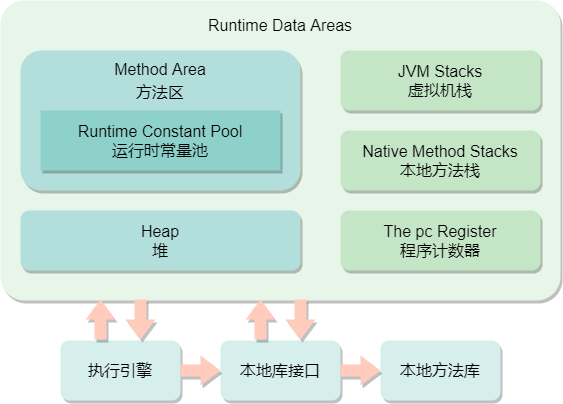
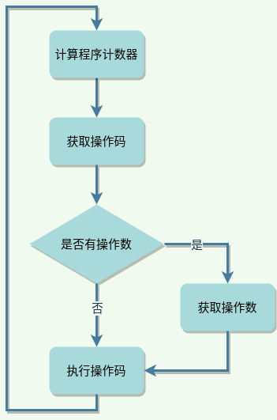
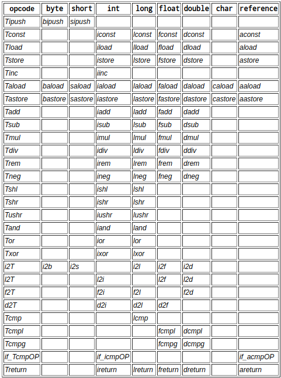

# Java虚拟机结构

> [《Java虚拟机规范》][jvm_spec_8]中定义了虚拟机的结构，包括：编译后的class文件格式，虚拟机数据类型，运行时数据区，异常，特殊方法，指令集等等，是Java虚拟机实现的基础。

## class文件

可以被Java虚拟机执行的编译后代码被表示为一种独立于硬件和操作系统的二进制格式，即我们所熟知的class文件，它精确定义了类和接口的表示型式。class文件是Java语言 **Write once, run anywhere** 的保证，关于class文件格式的详细说明，请祥见 [class文件格式](jvm/class-format.md) 章节。

## 虚拟机数据类型

Java虚拟机只操作两种类型的数据：基本类型和引用类型，相应的，也有两种类型的值可以被虚拟机操作、存储为变量、作为参数传递、作为方法返回值等。

### 基本类型和值

Java虚拟机支持三种基础类型和值：数值类型，布尔类型，*returnAddress* 类型。

#### 数值类型

数值类型又分为：整型和浮点型。

整型：

- `byte`，8位带符号二进制补码整数，值范围：-128 ~ 127，默认值为0
- `short`，16位带符号二进制补码整数，值范围：$-2^{15}$ ~ $2^{15}-1$，默认值为0
- `int`，32位带符号二进制补码整数，值范围：$-2^{31}$ ~ $2^{31}-1$，默认值为0
- `long`，64位带符号二进制补码整数，值范围：$-2^{63}$ ~ $2^{63}-1$，默认值为0
- `char`，16位无符号整数表示的`Unicode`码点，采用`UTF-16`编码，默认值为`\u0000`，表示空码点，值范围：`0 ~ 65535`

> **说明：** Java语言中的`char`类型在虚拟机中是被当作`int`类型来处理的

**示例：** 如下代码对两个`char`类型的变量进行比较和相减操作，编译器并没有报错

```java
char a = 'a';
char c = 'c';
System.out.println(c > a); // always true
System.out.println(c - a); // 2
```

通过`javap -v`命令查看编译后的class文件，可以发现编译器在编译后，变量`a`和`c`的值分别被转换成 97 和 99 这两个整型数值：

```text
Code:
  stack=3、locals=3、args_size=1
     0: bipush        97
     2: istore_1
     3: bipush        99
     5: istore_2
```

浮点型：

- `float`，值为单精度浮点型值集的元素，默认值为正0

- `double`，值为双精度浮点型值集的元素，默认值为正0

Java虚拟机中的浮点型数据遵循 *IEEE 754* 标准，这是一项关于二进制浮点型计算的 *IEEE* 标准，该标准不仅支持表示正负符号数，还支持表示正负0，正负无穷大，和一个特殊的 *Not-a-Number(NaN)* 值，用来表示不合法的数值操作结果，例如0除以0的值。

 `float`和`double`类型在概念上分别与32位单精度和64位双精度的 *IEEE 754* 标准中规定的值和操作有关。任何非零有限浮点型数值都可以表示为：$sm2^{(e-n+1)}$，其中，*s* 为符号位，值为-1或1；*m* 为有效数字位，取值范围是一个小于 *2N* 的正整数；*e* 为指数位，取值范围是介于 $E_{min}=-(2^{k-1}-2)$ 和 $E_{max}=2^{k-1}-1$ 之间的整数。*N* 和 *K* 为不同浮点型值集的参数。

每个Java虚拟机实现都要求必须实现两套浮点型值集：*float value set* 和 *double value set*，同时也可以额外实现 *float-extended-exponent value set* 和 *double-extended-exponent value set* 两套扩展值集。关于 *N* 和 *K* 这两个参数在不同值集中的取值约束如下表所示：

| 参数      | float | float-extended-exponent | double | double-extended-exponent |
| --------- | ----- | ----------------------- | ------ | ------------------------ |
| *N*       | 24    | 24                      | 53     | 53                       |
| *K*       | 8     | $\geq$ 11               | 11     | $\geq$ 15                |
| $E_{max}$ | +127  | $\geq$ +1023            | +1023  | $\geq$ +16383            |
| $E_{min}$ | -126  | $\leq$ -1022            | -1022  | $\leq$ -163382           |

#### 布尔类型

布尔类型的值为`true`或者`false`，默认值为`false`。

Java虚拟机虽然定义了布尔类型，但实际上对它的支持十分有限，并没有提供专门操作布尔值的虚拟机指令，相反，Java语言中对与布尔类型的操作会被虚拟机编译成`int`类型来操作。

Java虚拟机也不直接支持`boolean`类型数组，*newarray* 指令被用来创建`boolean`数组，而操作字节数组的 *baload* 和 *bastore* 指令则分别被用来访问和修改`boolean`数组。

> **说明：** Java虚拟机中使用1表示`true`，0表示`false`来对`boolean`数组元素进行编码。

**示例：** 如下是布尔类型及布尔类型数组的赋值操作

```java
boolean b = true;
boolean[] booleans = new boolean[]{true、false};
```

使用`javap -v`命令查看编译后的class文件可以发现，变量`b`的赋值语句使用的是 *iconst_1* 和 *istore_1* 这两个指令来完成的，而对布尔数组的赋值是通过 *bastore* 这个指令来完成的。

```text
Code:
  stack=4、locals=3、args_size=1
     0: iconst_1
     1: istore_1
     2: iconst_2
     3: newarray       boolean
     5: dup
     6: iconst_0
     7: iconst_1
     8: bastore
     9: dup
    10: iconst_1
    11: iconst_0
    12: bastore
    13: astore_2
    14: return
```

#### returnAddress类型

*returnAddress* 类型被 *jsr*、*ret*、 *jsr_w* 这三个Java虚拟机指令所使用，其值是指向虚拟机指令操作码的指针。在Java虚拟机的所有基本类型中，只有 *returnAddress* 类型不直接与任何一种Java语言的数据类型对应。

### 引用类型和值

Java虚拟机中有三种引用类型：class类型、数组类型、接口类型，它们的值分别是动态创建的类实例、数组、类实例。

引用类型的值也可是特殊的`null`引用，`null`没有初始的运行时类型，但是却可以转换为任何类型，引用类型的默认值就是`null`。

## 运行时数据区

Java虚拟机把它所管理的内存划分为多个不同的运行时数据区域，每个区域都有特定的用途，各自存储不同的数据。根据[《Java虚拟机规范》][jvm_spec_8]的定义，它所管理的内存被分为如下几个运行时数据区域：



其中，方法区和堆是线程共享区域，跟随Java虚拟机一起创建和销毁；虚拟机栈、本地方法区和程序计数器则是线程私有的，随着线程的启动和结束而创建和销毁。

### 程序计数器

程序计数器是Java虚拟机所管理的内存中比较小的一块区域，每一个线程都有一个各自的程序计数器，用于存储当前线程正在执行的字节码指令的地址。

如果线程当前正在执行的是非`native`方法，则程序计数器存的是字节码指令地址，如果当前正在执行的是`native`方法，则存储的值是 *undefined*。

程序计数器是Java虚拟机中唯一一个不会引起`OutOfMemoryError`的内存区域。

> **说明：** 由于Java虚拟机中的多线程是通过抢占处理器的执行时间来实现的，所以一个处理器在任何时刻都只能执行一个线程中的一个方法中的指令。因此，为了保证线程切换后能恢复到正确的执行位置，每个线程都必须有一个独立的程序计数器来存储当前正在执行的字节码指令地址。

### 虚拟机栈

虚拟机栈也是线程私有的内存区域，存储的是栈帧。每个方法被执行的时候，Java虚拟机都会同步创建一个栈帧，用于存储局部变量表、操作数栈、动态链接、方法出口信息等数据。线程中每个方法从调用到执行完毕的过程，就对应着一个栈帧在虚拟机栈中从入栈到出栈的过程。

[《Java虚拟机规范》][jvm_spec_8]中指出：除了对栈帧进行入栈和出栈操作之外，Java虚拟机不会直接操作虚拟机栈，虚拟机栈的内存也不必是连续的。

虚拟机栈的内存容量可以是固定值，也可以动态扩展。用户可以控制虚拟机栈的初始容量大小，在可动态扩展的情况下，还可以控制虚拟机栈的最大和最小容量。

> **说明：** HotSpot虚拟机的栈容量并不支持动态扩展的，但是可以在启动时通过`-Xss`参数设置虚拟机栈的初始容量。所以在HotSpot虚拟机中是不会由于虚拟机栈无法扩展而导致`OutOfMemoryError`异常，只要线程申请栈空间成功了就不会产生OOM异常，只会产生`StackOverflowError`，但是如果申请时就失败，仍然是会出现OOM异常的。

虚拟机栈还跟如下两类异常有关：

- `StackOverflowError`：如果线程请求的栈深度大于虚拟机允许的最大深度，就会抛出该异常。
- `OutofMemoryError` ：如果虚拟机栈的容量是可以动态扩展的，而当扩展无法申请到足够的内存时，就会抛出该异常。

#### 栈帧

栈帧在方法被调用的时候创建，方法调用完成后销毁（不管是正常执行结束或者发生异常结束）。栈帧所占用的内存空间由当前线程从虚拟机栈中分配，占用的空间大小则由具体的虚拟机实现来决定。

每个栈帧都有自己的局部变量表、操作数栈和对当前类的运行时常量池的引用。局部变量表和操作数栈的大小在编译期间就已经确定，这里所说的“大小”并非具体的内存空间大小，而是指容量大小。

**示例：** 使用`javap -v`命令查看一个class文件，可以看到类似如下内容

```text
Code:
  stack=4、locals=3、args_size=1
```

其中，*stack* 表示操作数栈的深度，*locals* 表示局部变量表所占槽位，*args_size* 表示方法中局部变量的数量。由此可以看出，栈帧中局部变量表和操作数栈的容量在编译时就已经确定，不会在运行期间改变。

##### 局部变量表

每个栈帧都有一个局部变量表，Java虚拟机在执行方法时用它来传递参数，局部变量表存储的是编译时已知的虚拟机基本类型变量（`byte`，`short`，`int`，`long`，`char`，`float`，`double`，`boolean`，`returnAddress`）和对象引用（*refrence* 类型）。

局部变量表由变量槽（Slot）组成，上述类型的局部变量就存在局部变量槽中，局部变量表通过序号来索引这些局部变量，序号从0开始。在实例方法的局部变量表中，索引位置0的局部变量槽存储的始终是指向对象实例本身的引用，即`this`。`long`类型和`double`的变量占用两个槽位，其他类型占用一个槽位。

**示例：** 如下方法中定义了四个基本类型参数

```java
public void localVariableTable(int i、long l、double d、char c) {
}
```

使用`javap -v`命令查看编译后的class文件，可以看到如下内容：

```text
LocalVariableTable:
  Start  Length  Slot  Name   Signature
  	  0       1     0  this   Lorg/jvm/LocalVariableTable;
  	  0       1     1     i   I
  	  0       1     2     l   J
  	  0       1     4     d   D
  	  0       1     6     c   C
```

其中，Slot列显示的即局部变量槽的索引序号。从中可以看出：第一个变量`this`，指向类实例本身，占用一个槽位；变量`i`和`c`各占用一个槽位，而变量`l`和`d`则占用两个槽位。

##### 操作数栈

每个栈帧都有一个操作数栈，操作数栈的最大深度也是编译期间就确定的，`long`和`double`类型数据占用两个单位的深度，其他类型数据占用一个单位深度。

栈帧被创建时，操作数栈是空的，虚拟机提供加载指令从局部变量表加载常量和值到操作数栈中，其他的虚拟机指令则从操作数栈中获取值，并进行操作，再把操作后的结果重新推到操作数栈中。操作数栈也被用来为方法传递参数和接收方法执行结果。

##### 动态链接

每个栈帧都有指向运行时常量池的引用来支持动态链接，class文件中的方法中的代码是通过符号引用来指向待执行的方法和需要访问的变量，动态链接负责将符号引用翻译成直接引用。

### 堆

堆是Java虚拟机管理的最大一块内存区域，随虚拟机的启动一起创建，是所有线程共享的区域，也是垃圾回收的重点区域，主要用于存放对象实例和数组。[《Java虚拟机规范》][jvm_spec_8]中指出：所有对象实例及数组都应当从堆中分配，且堆内存空间不必连续。

堆内存容量可以是固定值，也可以动态扩展。用户可以通过`-Xmx`和`-Xms`参数分别设置虚拟机堆内存的最大容量和初始容量，如果这两个参数值的相等，则虚拟机不会动态扩展。

堆也跟`OutofMemoryError` 异常有关，如果堆中没有足够的内存完成对象实例的分配，且无法扩展时，就会抛出该异常。

### 方法区

方法区跟堆一样，也是线程共享区域，随虚拟机的启动一起创建。方法区存储的是已被虚拟机加载的类的结构数据，如运行时常量池、类字段、方法数据，包括方法和构造器的代码等。

经常有一些文档或博客上将方法区和“永久代”这个概念混淆，其实两者并不等价。“永久代”和“年轻代”一样，都是垃圾回收领域中 *分代收集理论* 上的概念。在JDK的早期版本中，HotSpot虚拟机把垃圾收集器的分代设计扩展至了方法区，使得垃圾收集器可以像堆内存一样对方法区进行内存管理。在BEA JRockit、IBM J9等其他虚拟机实现中并不存在永久代的概念。

方法区是堆中的一块逻辑区域，但是[《Java虚拟机规范》][jvm_spec_8]并不强制虚拟机的具体实现对方法区也进行垃圾回收。方法区的容量大小可以是固定值，也可以动态扩展，内存空间也可以不连续。

当方法区无法满足新的内存分配请求时，也会抛出`OutofMemoryError`异常。

> **说明：** 不同JDK版本的HotSpot虚拟机中对方法区的实现并不一样，JDK6及以前版本的HotSpot虚拟机是使用永久代实现方法区的，到了JDK7，已经把原本放在永久代的字符串常量池、静态变量等移出，而到了JDK8的HotSpot虚拟机中，已经完全废弃了永久代，改用在本地内存中实现的元空间（MetaSpace）来代替。

**示例：** 如下代码在JDK6中，输出结果为`false`，而在JDK7及以上版本，则输出`true`

```java
String s1 = new StringBuilder("hello").append("world").toString();
System.out.println(s1.intern() == s1);
```

输出结果不同的原因在于 ：JDK6使用永久代来实现方法区，`intern()`方法会将首次出现的字符串实例拷贝到永久代的字符串常量池中，并返回永久代中该字符串的引用，而`StringBuilder`生成的字符串实例在堆中，所以返回`false`；而JDK7中已经将字符串常量池从永久代移出到堆中，`intern()`方法的实现不再需要拷贝字符串到永久代，返回的就是`StringBuilder`生成的字符串引用，因此返回`true`。上述代码示例可以很好的说明不同JDK版本中，虚拟机对方法区的不同实现方式所导致的差异。

### 运行时常量池

运行时常量池是方法区的一部分，每个运行时常量池都从方法区中分配内存，虚拟机创建类或接口时，会为该类和接口构建运行时常量池。

类或接口被编译后产生的class文件中会有一个常量池表，存放编译期间已知的各种字面量和符号引用，类或接口被虚拟机加载后，这个常量池表里的数据就存放在运行时常量池中。相比于class文件中的常量池表，运行时常量池里存储的数据还包含了运行时产生的新的常量。

跟方法区一样，运行时常量池也会产生`OutofMemoryError`异常。

### 本地方法栈

本地方法栈与虚拟机栈相似，通常由线程在创建时分配。虚拟机栈为Java方法服务，而本地方法栈则为`native`方法服务。

本地方法栈的容量可以是固定大小，也可以动态扩展。

本地方法栈同样也会抛出两种类型异常：

- `StackOverflowError`：如果线程请求的栈深度大于虚拟机允许的最大深度，就会抛出该异常。
- `OutofMemoryError` ：如果本地方法栈的容量是可以动态扩展的，而当扩展无法申请到足够的内存时，就会抛出该异常。

## 特殊方法

在Java虚拟机层面，有两个特殊方法：实例初始化方法`<init>`、类和接口初始化方法`<clinit>`，他们由编译器生成，并不符合Java语言的命名规范。

### 实例初始化方法

执行目的：`<init>`方法用于执行类构造器方法，完成对象实例的初始化工作，类中的每个构造器方法都会产生一个对应的`<init>`方法。

执行时机：虚拟机只有在需要初始化对象实例的时候（例如使用`new`关键字创建对象），才会执行`<init>`方法。

执行方式：`<init>`方法只能被虚拟机中的 *invokespecial* 指令调用。

### 类和接口初始化方法

执行目的：`<clinit>`方法的作用是对类和接口中的静态代码块和静态变量进行初始化。

执行时机：虚拟机会在类加载的初始化阶段调用`<clinit>`方法。

执行方式：`<clinit>`方法由虚拟机隐式地调用，没有任何虚拟机指令可以直接调用它，只能在类初始化过程中间接调用。

类或接口最多只有一个`<clinit>`方法，而且是无参的`void`方法。编译器不一定会为类或接口生成`<clinit>`方法，如果类中没有静态变量的赋值操作也没有静态代码块，或者接口中没有静态变量的赋值，则编译器都不会生成`<clinit>`方法。

`<clinit>`方法是由编译器自动收集类中静态变量的赋值动作和静态语句块中的代码合并而成的，编译器收集的顺序是由语句在代码中出现的顺序决定的，静态语句块中只能访问定义在静态块之前的变量，定义在静态块之后的静态变量在静态块中只能被赋值，不能被访问，否则编译器会报错：*非法前向引用*。

**示例：** 由于静态成员变量`i`定义在静态代码块之后，所以访问变量`i`时会导致编译器报错

```java
static {
    // 编译器可以正常编译通过
    i = 2;
    // 编译器报错：Illegal forward reference
    System.out.println(i);
}
private static int i = 1;
```

> **说明：** JDK7及以上版本的Java虚拟机规范中都要求class文件的`<clinit>`方法中必须有 *ACC_STATIC* 标志，而在JDK6及以前版本中，编译器生成的class文件的`<clinit>`方法中则没有该标志。

## 虚拟机中的对象

[《Java虚拟机规范》][jvm_spec_8]中并没有针对对象的内部结构作任何强制要求，完全由具体的虚拟机实现自己决定。在HotSpot虚拟机中，对象的具体结构请详见[对象内存布局](jvm/memory?id=对象内存布局)章节。

## 异常

Java虚拟机中的异常由`Throwable`类或其子类的一个实例来表示，抛出异常会立即导致控制转移。

大多数异常是由导致异常的线程同步发生的，相反，异步异常可能在程序执行的任何时候发生。

Java虚拟机在以下三种情况下会抛出异常：

- 虚拟机执行到 *athrow* 指令
- 虚拟机同步检测到非正常的执行情况
  - 指定异常作为一个可能的的结果
    - 指令操作违反了Java语言的语义，例如访问超出数组下标
    - 加载或链接过程中发生的错误
  - 超出一些资源的限制
- 异步异常发生
  - 执行`Thread`或`ThreadGroup`类的`stop()`方法
  - Java虚拟机实现的内部错误

## 指令集摘要

Java虚拟机指令由一个字节的操作码和操作数（0个或多个）组成，操作码指定了要执行的操作，操作数提供参数或数据。很多虚拟机指令没有操作数，只有操作码。

操作数的数量由操作码决定，如果一个操作数大于一个字节，则按照高位在前的顺序分割存储。

在忽略异常的情况下，虚拟机解释器对虚拟机指令的内部执行循环大体如下图所示：



### 虚拟机指令和类型

Java虚拟机指令集中大多数指令都是针对特定类型的操作，例如：*iload* 指令用于从局部变量表中加载`int`类型的数据，而 *fload* 指令则用于加载`float`类型的数据，这两个指令可以拥有相同的实现，但是操作码却不相同。

Java虚拟机中各类型支持的指令集如下表（来源：[Types and the Java Virtual Machine][type_for_jvm_instruct]）所示：



### 加载和存储指令

*load* 和 *store* 这两类指令用于在局部变量表和操作数栈中传递数据。

- 从局部变量表加载数据到操作数栈中：*iload*、*iload_\<n\>*、*lload*、*lload_\<n\>*、*fload*、*fload_\<n\>*、*dload*、*dload_\<n\>*、*aload*、*aload_\<n\>*
- 从操作数栈中将数据存到局部变量表中：*istore*、*istore_\<n\>*、*lstore*、*lstore_\<n\>*、*fstore*、*fstore_\<n\>*、*dstore*、*dstore_\<n\>*、*astore*、*astore_\<n\>*
- 加载常量到操作数栈中：*bipush*、*sipush*、*ldc*、*ldc_w*、*ldc2_w*、*aconst_null*、*iconst_m1*、*iconst_\<i\>*、*lconst_\<l\>*、*fconst_\<f\>*、*dconst_\<d\>*
- 使用一个更大的索引访问局部变量表：*wide*

上述指令中带下划线和尖括号的指令其实代表一个指令族，例如：*iload_\<n\>* 表示 *iload_0*、 *iload_1*、 *iload_2*、 *iload_3* 这四个指令。*iload_\<n\>* 指令可以理解为 *iload n* 的缩写，*iload* 是操作码，*n* 是操作数，表示将局部变量表中下标为 *n* 位置的`int`类型数据加载到操作数栈中，而 *iload_\<n\>* 这种特殊指令只通过一个操作码就实现了这种操作，省去了操作数的空间，这其实是Java虚拟机早期的一个优化。

上述指令中的 *\<n\>* 表示非负整数，而 *\<i\>* 表示`int`类型，*\<l\>* 表示`long`类型，*\<f\>* 表示`float`类型，*\<d\>* 表示`double`类型，因此 *iconst_\<i\>*、*lconst_\<l\>*、*fconst_\<f\>*、*dconst_\<d\>* 这四个指令分别表示定义`int`类型、`long`类型、`float`类型、`double`类型的常量，而 *icnost_m1* 则专用来定义 -1 这个常量。

> **说明：** 虚拟机指令的操作码占用一个字节大小，即8位，因此Java虚拟机的操作码不超过256个。至于为什么类似 *iload_\<n\>* 这种特殊指令只有很少的有限个数，可能是因为当时Java虚拟机指令操作码设计好发现总共并没有达到256个，还剩不少，于是用剩下的操作码编码空间进行了有限个数的指令优化。关于虚拟机指令更详细的内容请见：[Chapter 6. The Java Virtual Machine Instruction Set][jvm_spec_8_c6]

### 算数指令

Java虚拟机中的算数指令分为两大类，分别用于操作整型数值和浮点型数值。`byte`、`short`、`char`、`boolean`类型的算数操作其实是由`int`类型的操作指令来完成的。

Java虚拟机中的算数指令如下：

- 加：*iadd*、*ladd*、*fadd*、*dadd*
- 减：*isub*、*lsub*、*fsub*、*dsub*
- 乘：*imul*、*lmul*、*fmul*、*dmul*
- 除：*idiv*、*ldiv*、*fdiv*、*ddiv*
- 取余：*irem*、*lrem*、*frem*、*drem*
- 取非：*ineg*、*lneg*、*fneg*、*dneg*
- 左移右移：*ishl*、*ishr*、*iushr*、*lshl*、*lshr*、*lushr*
- 按位或：*ior*、*lor*
- 按位与：*iand*、*land*
- 按位抑或：*ixor*、*lxor*
- 自增：*iinc*
- 比较操作：*dcmpg*、*dcmpl*、*fcmpg*、*fcmpl*、*lcmp*

### 类型转换指令

Java虚拟机允许数值类型进行类型转换，并且直接支持以下三种向上转型：

- `int`转为`long`、`float`或`double`
- `long`转为`float`或`double`
- `float`转为`double`

以上类型转换对应的指令为：*i2l*、*i2f*、*i2d*、*l2f*、*l2d* 和 *f2d*

Java虚拟机还支持以下向下转型：

- `int`转为`byte`、`shot`或`char`
- `long`转为`int`
- `float`转为`int`或`long`
- `double`转为`int`、`long`或`float`

以上转型对应的指令为：*i2b*、*i2c*、*i2s*、*l2i*、*f2i*、*f2l*、*d2i*、*d2l* 和 *d2f*

### 对象创建和操作指令

虽然数组也是一种对象，但是Java虚拟机创建和操作对象的指令与创建和操作数组的指令却不一样：

- 创建一个类实例：*new*
- 创建一个新数组：*newarray*、*anewarray*、*multianewarray*
- 访问或修改类变量：*getstatic*、*putstatic*、*getfield*、*putfield*
- 加载数组到操作数栈：*baload*、*caload*、*saload*、*iaload*、*laload*、*faload*、*daload*、*aaload*
- 从 操作数栈中存储数组到局部变量表：*bastore*、*castore*、*sastore*、*iastore*、*lastore*、*fastore*、*dastore*、*aastore*
- 获取数组长度：*arraylength*
- 检查类实例或数组属性：*instanceof*、*checkcast*

### 操作数栈管理指令

直接操作操作数栈的指令：*pop*、*pop2*、*dup*、*dup2*、*dup_x1*、*dup2_x1*、*dup_x2*、*dup2_x2*、*swap*

### 控制转移指令

以下指令会发生控制转移：

- 条件分支：*ifeq*、*ifne*、*iflt*、*ifle*、*ifgt*、*ifge*、*ifnull*、*ifnonnull*、*if_icmpeq*、*if_icmpne*、*if_icmplt*、*if_icmple*、*if_icmpgt* *if_icmpge*、*if_acmpeq*、*if_acmpne*
- 符合条件分支：*tableswitch*、*lookupswitch*
- 非条件分支：*goto*、*goto_w*、*jsr*、*jsr_w*、*ret*

### 方法调用和返回指令

以下指令用于调用方法：

- 调用对象的实例方法：*invokevirtual*，根据对象的实际类型进行分派，这是Java语言中常规的方法分派
- 调用接口方法：*invokeinterface*，根据运行时的具体对象找到合适的实现方法进行调用
- 调用特殊方法：*invokespecial*，执行[特殊方法](#特殊方法)，私有方法或父类方法
- 调用静态方法：*invokestatic*，执行类中的静态方法
- 调用动态方法：*invokedynamic*，这是JDK7新增的指令，目的是为了使Java提供对动态语言的支持

方法返回指令根据返回类型进行区别：*ireturn* 用于返回`int`、`byte`、`short`、`char`、`boolean`类型的值，*lreturn*、*freturn*、*dreturn* 和 *areturn* 分别用于返回`long`、`float`、`double`和引用类型的值。另外，*return* 用于返回`void`方法，`<init>`和`<clinit>`方法

### 异常抛出指令

*athrow* 指令用于显示抛出异常，Java虚拟机的很多其他指令也会在遇到异常情况的时候抛出异常。

### 同步指令

Java虚拟机支持方法级别的同步，也支持方法内部一组指令序列的同步。

方法级别的同步是隐式执行的，如果调用方法的指令检测到调用的方法有 *ACC_SYNCHRONIZED* 标志，当前线程就会进入一个监视器，在该方法执行完成或发生异常而退出监视器之前，其他线程都无法进入这个监视器。

指令序列的同步通常是在Java代码的同步块中使用到，Java虚拟机提供了 *monitorenter* 和 *monitorexit* 指令来支持这种同步。

[jvm_spec_8]: https://docs.oracle.com/javase/specs/jvms/se8/html/index.html
[jvm_spec_8_c6]: https://docs.oracle.com/javase/specs/jvms/se8/html/jvms-6.html
[type_for_jvm_instruct]: https://docs.oracle.com/javase/specs/jvms/se8/html/jvms-2.html#jvms-2.11.1
