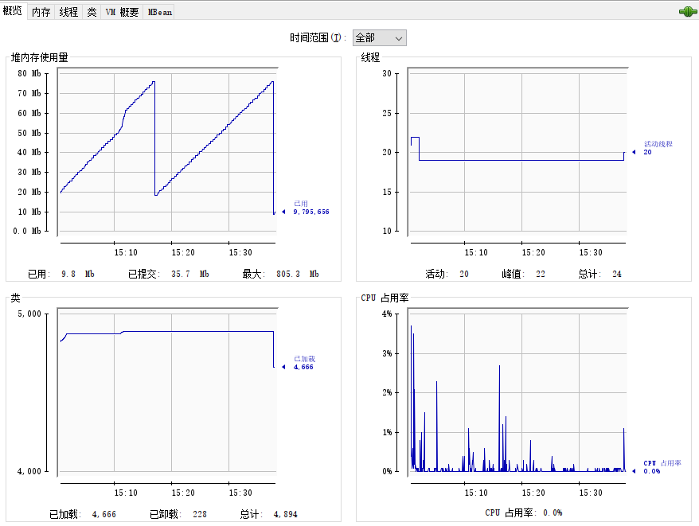
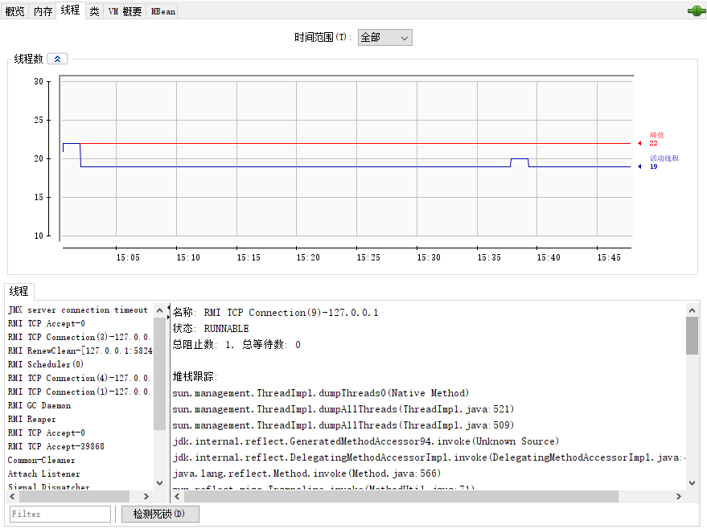
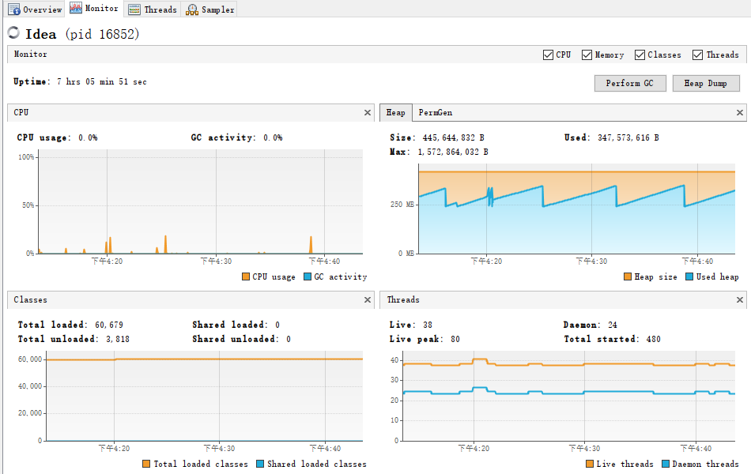
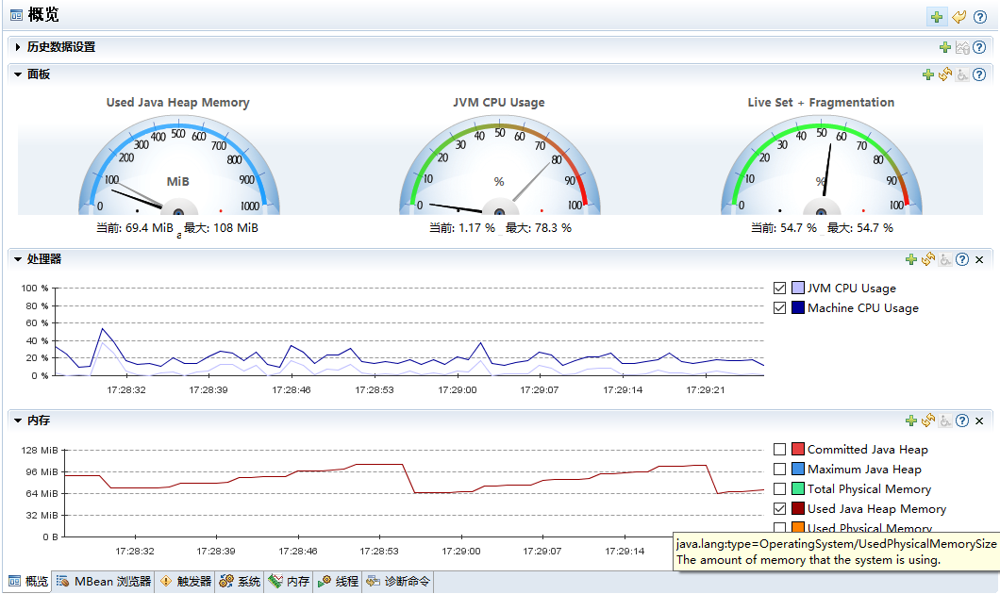
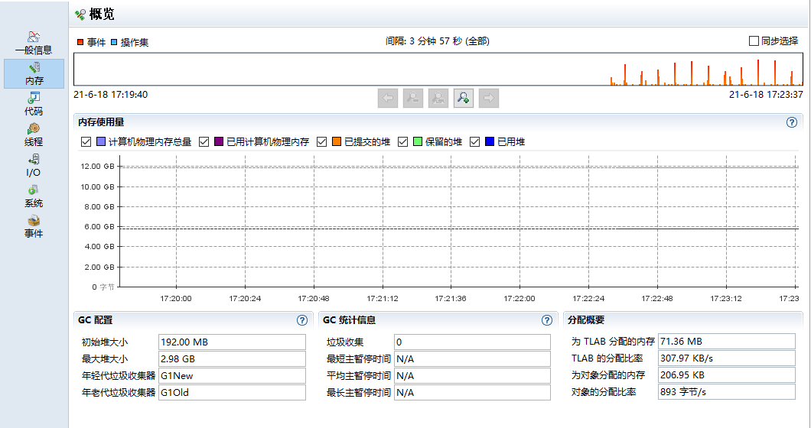

# Troubleshooting

一般来说，Java虚拟机Troubleshooting需要先收集相关数据，再对收集的数据进行分析，从而定位出问题。

需要收集的数据一般包含：异常堆栈、虚拟机运行日志、垃圾收集器日志、线程快照 （threaddump/javacore文件）和堆转储快照（heapdump/hprof文件）等

常用的分析工具有：命令行工具（jps、jinfo、jmap、jhat、jstack、jstat等）和可视化分析工具（JConsole、VisualVM、JMC等）

## 数据收集

为了在JVM发生crash时能方便地收集到相关数据，通常需要在启动JVM进程时做一些设置，用来记录虚拟机发生crash时的线程执行情况、GC情况，堆内存情况等相关信息。常用的设置有：

- javacore文件：在Linux/Solaris系统中，启动JVM进程之前，可以通过 *ulimit -c unlimited* 命令使JVM在发生crash的时候自动生成javacore文件（一般默认不会生成）
- heapdump文件：在Java虚拟机启动命令中添加`-XX:+HeapDumpOnOutOfMemoryError`选项，可以使得虚拟机抛出`OutOfMemoryError`时生成heapdump文件
- hs_err文件：Java虚拟机发生致命错误时，会生成一个错误文件 *hs_err_pid\<pid\>.log*，这个文件里包含很多关键信息（如：导致crash的线程信息、所有线程信息、安全点和锁信息、堆信息、gc相关记录、JVM启动参数等）。在JDK6及以上版本可以通过`-XX:ErrorFile=./hs_err_pid<pid>.log`参数来设置hs_err文件的输出路径。
- 输出threaddump信息：先通过 *jps* 工具找到对应的虚拟机进程号，然后再通过 *jcmd \<pid\> Thread.print* 命令输出详细的线程栈信息。在Linux系统中，也可以通过 *kill -3 \<pid\>* 命令来输出thread dump信息
- 输出详细GC日志：在Java虚拟机启动命令中添加`-verbose:gc`选项，可以使虚拟机在发生GC时输出详细日志
- 输出JVM启动参数：在Java虚拟机启动命令中添加`-XX:+PrintCommandLineFlags`选项，可以使虚拟机输出启动参数

> **说明：** 在重启JVM之前一定要尽可能多收集相关数据来帮助问题定位

### JMX MBean

JMX（Java Management Extensions）技术提供了一种简单的标准方式来管理资源（如：Java虚拟机、应用程序、设备和服务）。

JMX通过一个或多个称为MBean（Managed Bean）的Java对象对特定资源进行检测和管理。MBean可以表示设备、应用或者任何需要管理的资源，这些MBean注册在MBeanServer中。

JConsole工具就是通过MBean对Java虚拟机进行监视的。

### Java Flight Recorder

Java Flight Recorder（JFR，飞行记录器）能够用很小的开销记录JVM和Java应用的运行时相关数据，帮助开发者进行分析诊断。JFR是一JDK中的一个商业化功能，允许在本地开发环境（台式机/笔记本）中使用，但在生产环境中使用需要商业许可证。

JFR记录有两种类型：

- 连续记录（Continuous Recordings）：记录一直开启，开销非常小，默认不会收集堆内存的统计和分配信息，对于debug极少发生的问题很有用。可以使用 *jcmd* 和JMC工具将记录转储，也可以在JMC中设置触发器，满足触发条件时进行转储
- 分析记录（Profiling Recordings）：记录开启一段时间，然后停止。分析记录会收集更多的事件数据，对应用性能的影响也更大一点。分析记录的常见用途有：
  - 查看哪个方法一直在运行或者哪里一直在创建对象
  - 查找哪个类导致了内存泄漏
  - 查找同步代码的性能瓶颈

> **说明：** JFR的额外开销通常只有2%左右，因此可以在生产环境开启，除非对性能或延迟非常敏感

由于JFR是一款商业工具，默认不开启。在JDK 8u40之前版本必须在JVM启动时添加`-XX:+UnlockCommercialFeatures -XX:+FlightRecorder`选项（在OpenJDK 8u版本中并不支持该选项）来开启JFR记录，而JDK 8u40之后的版本可以在JVM运行时开启。

开启JFR记录的方式有：

- 使用JMC工具开启JFR记录：JMC工具默认会列出本地正在运行的JVM。通过JMC工具，用户可以检查正在运行的JFR记录，也可以将JFR记录转储到文件中，还可以开启新的记录

- 在虚拟机启动时使用命令行选项生成JFR记录：

  ```bash
  # 延迟20s开启JFR记录，开启时长为60s，记录名称为myrecording，存到C:\TEMP\myrecording.jfr文件中
  java -XX:+UnlockCommercialFeatures -XX:+FlightRecorder -XX:StartFlightRecording=delay=20s,duration=60s,name=myrecording,filename=C:\TEMP\myrecording.jfr,settings=profile MyApp
  ```

- 使用JMC工具配置触发器自动生成JFR记录：JMC工具中还可以通过JMX Browser来配置触发器，在满足条件时自动开启JFR记录。常用的触发器配置有：CPU使用率过高、线程死锁、GC过于频繁等

## 常用工具

有很多工具可以用来对Java虚拟机和Java应用进行诊断分析，包括命令行工具和可视化工具。

### 命令行工具

> **说明：** 由于JDK版本的不同，以下介绍的命令行工具的用法示例可能与实际有所不同，可以先通过 *-help* 选项来查看使用帮助。

#### jps

[jps][jps]工具用于查看本地Java虚拟机进程。该工具实验性的，JDK8中已经不建议使用，可用jcmd代替。

**语法：** *jps [ options ] [ hostid ]*

常用命令示例及说明：

```bash
# 查看jps使用帮助
jps -help

# 输出虚拟机进程ID和主类全限定名
jps -l

# 输出虚拟机进程启动时的参数
jps -v

# 输出虚拟机进程启动时传给主类main()函数的参数
jps -m
```

#### jinfo

[jinfo][jinfo]工具用于输出JVM的配置信息及系统配置。该工具实验性的，JDK8中已经不建议使用，可用jcmd代替。

**语法：** *jinfo [ option ] pid*

常用命令示例及说明：

```bash
# 查看jinfo使用帮助
jinfo -help

# 根据<pid>查看虚拟机标志和系统变量配置
jinfo <pid>

# 根据<pid>查看虚拟机标志
jinfo -flags <pid>

# 根据<pid>查看系统变量配置
jinfo -sysprops <pid>
```

#### jmap

[jmap][jmap]工具用于输出虚拟机内存相关的统计数据。该工具实验性的，JDK8中已经不建议使用，可用jcmd代替。

**语法：** *jmap [ options ] pid*

常用命令示例及说明：

```bash
# 查看jmap使用帮助
jmap -help

# 查看堆内存的配置及使用情况
jmap -heap <pid>

# 查看堆内存中存活的对象信息，与jcmd <pid> GC.class_histogram功能类似
jmap -histo:live <pid>

# 转储堆中存活的对象信息，存储格式为hprof，存储文件名称为filename
jmap -dump:live,format=b,file=filename <pid>

# 查看类加载器加载的类数量、大小、是否存活、父类加载器等相关信息
jmap -clstats <pid>

# 查看等待执行finalize()方法的对象信息
jmap -finalizerinfo <pid>
```

#### jhat

[jhat][jhat]工具（Heap Analysis Tool，HAT）用于对Heap Dump文件（hprof）进行分析，并启动一个Http服务用于查看分析结果。该工具实验性的，JDK8中已经不建议使用，可用jcmd代替。

**语法：** *jhat [ options ] heap-dump-file*

常用命令示例及说明：

```bash
# 查看jhat使用帮助
jhat -help

# 分析snapshot.hprof文件，并在1234端口（默认端口：7000）开启http服务
jhat -port 1234 snapshot.hprof
```

#### jstack

[jstack][jstack]工具生成当前的虚拟机线程快照。该工具实验性的，JDK8中已经不建议使用，可用jcmd代替。

**语法：** *jstack [ options ] pid*

常用命令示例及说明：

```bash
# 查看jstack使用帮助
jstack -help

# 查看当前虚拟机线程快照
jstack <pid>

# 当正常输出请求不被响应时，强制输出线程栈信息
jstack -F <pid>

# 查看线程栈信息，还有关于锁的附加信息
jstack -l <pid>

# 查看虚拟机栈和本地方法栈信息
jstack -m <pid>
```

#### jstat

[jstat][jstat]工具用于监视Java虚拟机的各种运行状态信息。该工具实验性的，JDK8中已经不建议使用，可用jcmd代替。

**语法：** *jstat [ generalOption | outputOptions vmid [ interval[s|ms] [ count ] ]*

选项说明：

| 选项              | 说明                                                         |
| ----------------- | ------------------------------------------------------------ |
| -class            | 输出类加载、卸载数量、占用的内存空间、类加载耗时等信息       |
| -compiler         | 输出JIT编译器编译过的方法、耗时等信息                        |
| -gc               | 输出堆内存中Eden区、2个Survivor区、老年代、元数据区的内存容量和使用情况，以及GC次数和耗时等信息 |
| -gccapacity       | 与-gc类似，额外输出堆中各区域使用到的最大、最小空间占用等信息 |
| -gccause          | 与-gcutil类似，额外输出上次GC产生的原因                      |
| -gcmetacapacity   | 输出元数据空间中使用到的最大、最小空间占用等信息             |
| -gcnew            | 输出新生代内存占用及Young GC等信息                           |
| -gcnewcapacity    | 与-gcnew类似，额外输出最大、最小空间占用等信息               |
| -gcold            | 输出老年代、元数据空间内存占用及Young GC、Full GC等信息      |
| -gcoldcapacity    | 与-gcold类似，额外输出最大、最小空间占用等信息               |
| -gcutil           | 与-gc类似，把具体占用大小改为百分比输出                      |
| -printcompilation | 输出已经被JIT编译的方法                                      |

常用命令示例及说明：

```bash
# 查看jstat使用帮助
jstat -help

# 查看类加载信息
# Loaded  Bytes  Unloaded  Bytes     Time
#  21969 44311.6        0     0.0      19.70
jstat -class <pid>

# 查看JIT编译信息
# Compiled Failed Invalid   Time   FailedType FailedMethod
#    11741      4       0    73.12          1 com/sun/jersey/core/reflection/AnnotatedMethod findAnnotatedMethod
jstat -compiler <pid>

# 每隔250毫秒查询进程id为<pid>的内存占用及垃圾收集情况，一共查询7次
# S0     S1     E      O      M     CCS    YGC     YGCT    FGC    FGCT     GCT
# 0.00   0.00  10.00  42.95  96.21  90.93      4    0.018    10    0.403    0.421
# 0.00   0.00  10.00  42.95  96.21  90.93      4    0.018    10    0.403    0.421
# 0.00   0.00  10.00  42.95  96.21  90.93      4    0.018    10    0.403    0.421
# 0.00   0.00  10.00  42.95  96.21  90.93      4    0.018    10    0.403    0.421
# 0.00   0.00  10.00  42.95  96.21  90.93      4    0.018    10    0.403    0.421
# 0.00   0.00  10.00  42.95  96.21  90.93      4    0.018    10    0.403    0.421
# 0.00   0.00  10.00  42.95  96.21  90.93      4    0.018    10    0.403    0.421
jstat -gcutil <pid> 250 7

# 查看最后一次GC原因及情况
# S0     S1     E      O      M     CCS    YGC     YGCT    FGC    FGCT     GCT    LGCC                 GCC
# 0.00 100.00   1.72  73.86  98.07  97.55   6471   54.731     1    0.769   55.500 G1 Evacuation Pause  No GC
jstat -gccause <pid>
```

#### jcmd

[jcmd][jcmd]工具用于向JVM发送诊断请求，这些请求可以用于控制JFR记录，诊断JVM和Java应用，jcmd只能用于向本地JVM发送请求，并且jcmd只能用与启动JVM进程相同的用户名和用户组启动。

**语法：** *jcmd pid|main-class command[ arguments]*

常用命令示例及说明：

```bash
# 查看jcmd使用帮助
jcmd -help

# 列出本地JVM进程：jcmd 或 jcmd -l
jcmd -l

# 根据 <pid> 或 <main class> 查看具体帮助
jcmd <pid | main class> help

# 输出虚拟机和JDK版本id
jcmd <pid | main class> VM.version

# 输出虚拟机系统属性
jcmd <pid | main class> VM.system_properties

# 输出虚拟机标志
jcmd <pid | main class> VM.flags

# 输出虚拟机运行时长
jcmd <pid | main class> VM.uptime

# 转储虚拟机堆内存，生成HPROF文件，filename为生成的文件名（不会自动添加.hprof文件后缀）
jcmd <pid | main class> GC.heap_dump filename

# 输出虚拟机类和实例统计信息，这个实际输出结果较长，可以重定向到文件中
# <pid>:
#  num     #instances         #bytes  class name
# ----------------------------------------------
#    1:          5000         456280  [C
#    2:           436         135352  [B
#    3:          4850         116400  java.lang.String
#    4:           879         100616  java.lang.Class
#    5:           933          52032  [Ljava.lang.Object;
#    6:           791          31640  java.util.TreeMap$Entry
#    7:           623          24920  java.util.LinkedHashMap$Entry
#    8:           429          18960  [Ljava.lang.String;
#    9:           149          13112  java.lang.reflect.Method
#   10:           209          11704  java.lang.invoke.MemberName
jcmd <pid | main class> GC.class_histogram

# 输出虚拟机线程栈信息，这个实际输出结果较长，可以重定向到文件中
jcmd <pid | main class> Thread.print

# 检查是否开启JFR记录
# <pid>:
# No available recordings.
jcmd <pid | main class> JFR.check

# 开启名称为MyRecording的JFR记录，延迟20s开启，开启时长为2分钟，记录结果保存到myrecording.jfr中
jcmd <pid | main class> JFR.start name=MyRecording settings=profile delay=20s duration=2m filename=myrecording.jfr

# 关闭名称为MyRecording的JFR记录
jcmd <pid | main class> JFR.stop name=MyRecording
```

jcmd是一款多功能整合工具，包含了很多之前介绍的基础命令行工具的功能。对比如下：

| 功能                 | 基础工具                | jcmd                              |
| -------------------- | ----------------------- | --------------------------------- |
| 查看本地虚拟机进程   | jps -ml                 | jmcd                              |
| 查看虚拟机启动标志   | jinfo -flags \<pid\>    | jcmd \<pid\> VM.flags             |
| 查看系统变量配置     | jinfo -sysprops \<pid\> | jcmd \<pid\> VM.system_properties |
| 转储堆内存           | jmap -dump \<pid\>      | jcmd \<pid\> GC.heap_dump         |
| 查看类和对象统计信息 | jmap -histo \<pid\>     | jcmd \<pid\> GC.class_histogram   |
| 查看线程快照         | jstack \<pid\>          | jcmd \<pid\> Thread.print         |

jcmd还可以用于访问Native Memory Tracking（NMT）数据。NMT是HotSpot虚拟机中提供的一个功能，它用来追踪虚拟机本地内存（堆外内存）的使用情况。NMT功能默认关闭，可以通过`-XX:NativeMemoryTracking=summary`或`-XX:NativeMemoryTracking=detail`虚拟机标志来开启，开启后会有5-10%的额外资源消耗。

启用本机内存跟踪时，可以通过`-XX:+UnlockDiagnosticVMOptions -XX:+PrintNMTStatistics`标志使得虚拟机退出时输出内存的最后使用情况。输出内容详细程度基于跟踪级别（summary或detail）。

> **说明：** 在JDK8中，NMT不追踪第三方本地内存分配JDK类库

可以使用jcmd工具来访问NMT数据，辅助分析诊断堆外内存溢出等问题：

```bash
# 输出内存概要情况，需要启用-XX:NativeMemoryTracking=summary标志
# <pid>:
# 
# Native Memory Tracking:
# 
# Total: reserved=3488481KB, committed=243645KB                               <--- 当前总共占用大约240M内存
# -                 Java Heap (reserved=2070528KB, committed=131072KB)
#                             (mmap: reserved=2070528KB, committed=131072KB)
# 
# -                     Class (reserved=1062017KB, committed=10113KB)         <--- 元数据信息大约占用10M内存
#                             (classes #522)                                  <--- 已加载522个类
#                             (malloc=5249KB #210)
#                             (mmap: reserved=1056768KB, committed=4864KB)
# 
# -                    Thread (reserved=16453KB, committed=16453KB)           <--- 线程大约占用16M内存
#                             (thread #17)                                    <--- 当前有17个线程在运行
#                             (stack: reserved=16384KB, committed=16384KB)
#                             (malloc=52KB #96)
#                             (arena=17KB #30)
# 
# -                      Code (reserved=249647KB, committed=2583KB)           <--- JIT编译器当前缓存了大约2M内存
#                             (malloc=47KB #368)
#                             (mmap: reserved=249600KB, committed=2536KB)
# 
# -                        GC (reserved=81612KB, committed=75200KB)           <--- GC占用大约75M内存
#                             (malloc=5772KB #119)
#                             (mmap: reserved=75840KB, committed=69428KB)
# 
# -                  Compiler (reserved=141KB, committed=141KB)               <--- JIT编译占用141K内存
#                             (malloc=7KB #34)
#                             (arena=134KB #6)
# 
# -                  Internal (reserved=5980KB, committed=5980KB)
#                             (malloc=5916KB #1509)
#                             (mmap: reserved=64KB, committed=64KB)
# 
# -                    Symbol (reserved=1787KB, committed=1787KB)             <--- 符号占用不到2M内存
#                             (malloc=1076KB #210)
#                             (arena=712KB #1)
# 
# -    Native Memory Tracking (reserved=129KB, committed=129KB)
#                             (malloc=73KB #1025)
#                             (tracking overhead=57KB)
# 
# -               Arena Chunk (reserved=186KB, committed=186KB)
#                             (malloc=186KB)
jcmd <pid | main class> VM.native_memory summary

# 输出内存概要情况，需要启用-XX:NativeMemoryTracking=detail标志
jcmd <pid | main class> VM.native_memory detail

# 创建内存快照，作为对比的基线
jcmd <pid | main class> VM.native_memory baseline

# 2.与baseline对比，并输出内存详细情况
# <pid>:
# 
# Native Memory Tracking:
# 
# Total: reserved=3488495KB +13KB, committed=243659KB +13KB                  <--- 与baseline相比，总共多占用了13k内存
# 
# -                 Java Heap (reserved=2070528KB, committed=131072KB)
#                             (mmap: reserved=2070528KB, committed=131072KB)
# 
# -                     Class (reserved=1062017KB, committed=10113KB)
#                             (classes #522)
#                             (malloc=5249KB #209)
#                             (mmap: reserved=1056768KB, committed=4864KB)
# ...
jcmd <pid | main class> VM.native_memory detail.diff

# 关闭NMT
jcmd <pid | main class> VM.native_memory shutdown
```

### 可视化工具

常用的可视化工具有：JConsole、VisualVM、JMC。

#### JConsole

JConsole是一款基于JMX（Java Management Extensions）的可视化监视工具，通过JMX的MBean（Managed Bean）对虚拟机运行数据进行收集。

JConsole不仅可以监视本地虚拟机进程，还可以进行远程监视。进行远程监视需要远程虚拟机进程开启JMX功能，在远程虚拟机启动时，添加如下启动项：

```
# 配置JMX连接ip地址，这里需要配置远程服务器的ip
-Djava.rmi.server.hostname=127.0.0.1

# 配置JMX连接端口号，默认：1099
-Dcom.sun.management.jmxremote.port=1099

# 配置JMX连接是否启用SSL
-Dcom.sun.management.jmxremote.ssl=false

# 配置JMX连接是否需要开启登录认证
# 如果为true，还需要通过如下两个启动项来配置用户、密码及权限
# -Dcom.sun.management.jmxremote.password.file=../conf/jmxremote.password
# -Dcom.sun.management.jmxremote.access.file=../conf/jmxremote.access
-Dcom.sun.management.jmxremote.authenticate=false
```

JConsole可以对堆内存、线程、类加载、CPU使用率、虚拟机参数等信息等进行监视，如下图所示：



JConsole还可以检测线程死锁：



#### VisualVM

VisualVM是功能最强大的运行监视和故障处理程序之一，它是一款**All-in-One**的Java虚拟机可视化诊断工具。与JConsole一样，VisualVM也可以通过JMX对远程虚拟机进程进行监视和分析。



VisualVM功能包括：

- 显示虚拟机进程配置、环境等信息（jps、jinfo）
- 监视CPU使用率、堆和方法区、类加载、线程等信息（jstat、jstack）
- 分析堆转储快照（jmap、jhat）
- dump内存、线程快照信息
- 方法级的程序运行性能分析，能够找出被调用最多、运行时间最长的方法

除此之外，VisualVM还提供了插件机制，可以通过插件来扩展功能。

在OracleJDK中，VisualVM被自动集成为jvisualvm；而OpenJDK中并没有自动集成，可以通过[VisualVM官网][visualvm]下载Standalone版本。

#### JMC

Java Mission Control（JMC）是OracleJDK中一款新的可视化性能监控诊断工具，目前OpenJDK的JMC工具中还处在开发阶段，也可以通过[AdoptOpenJDK][adoptjdk]提前试用。

JMC既可以作为JMX控制台，显示虚拟机MBean提供的数据；也可以作为JFR的分析工具，显示JFR的数据。

MBean数据概览：



JFR数据概览：



[jps]: https://docs.oracle.com/javase/8/docs/technotes/tools/unix/jps.html
[jinfo]: https://docs.oracle.com/javase/8/docs/technotes/tools/unix/jinfo.html
[jmap]: https://docs.oracle.com/javase/8/docs/technotes/tools/unix/jmap.html
[jhat]: https://docs.oracle.com/javase/8/docs/technotes/tools/unix/jhat.html
[jstack]: https://docs.oracle.com/javase/8/docs/technotes/tools/unix/jstack.html
[jstat]: https://docs.oracle.com/javase/8/docs/technotes/tools/unix/jstat.html
[jcmd]: https://docs.oracle.com/javase/8/docs/technotes/tools/windows/jcmd.html
[visualvm]: https://visualvm.github.io/
[adoptjdk]: https://adoptopenjdk.net/?variant=openjdk8&jvmVariant=hotspot
